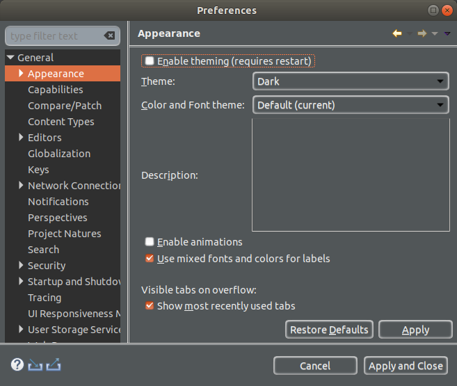

[TOC]


# Fedora

## Chrome

### Install

```
sudo dnf install fedora-workstation-repositories -y
sudo dnf config-manager --set-enabled google-chrome
sudo dnf install google-chrome-stable -y
```

## Typora

### Install

```
wget -c https://typora.io/linux/Typora-linux-x64.tar.gz

tar xvzf Typora-linux-x64.tar.gz -C ${HOME}

cat >> ${HOME}/.local/share/applications/typora.desktop << EOF
#!/usr/bin/env xdg-open
[Desktop Entry]
Version=1.0
Terminal=false
Type=Application
Name=Typora
Exec=/home/fr054721/bin/Typora-linux-x64/Typora
Icon=/home/fr054721/bin/Typora-linux-x64/resources/assets/icon/icon_32x32@2x.png
EOF
```

## Tuning

### Enable simple password

```
PASSWORD="abc123"
ADMIN="fr054721"
sudo /usr/bin/authselect
sudo /usr/bin/authselect select sssd --force
echo "${PASSWORD}" | sudo passwd root --stdin -f
echo "${PASSWORD}" | sudo passwd ${ADMIN} --stdin -f
```

### Manage Microsoft Defender ATP

```
sudo systemctl stop mdatp
```

### Manage Tivoli Endpoint Manager

```
sudo systemctl stop besclient
```


## Java

### Search for JDK

```
sudo dnf search openjdk
```

### Install Java 11

```
sudo dnf install java-11-openjdk -y
```

### Install Java 8

```
sudo dnf install java-1.8.0-openjdk -y
sudo dnf install java-1.8.0-openjdk-devel -y
```

### Install latest Java

```
sudo dnf install java-17-openjdk -y
```

### Switch between Java version

```
sudo alternatives --config java
java -version
```

## DBeaver

### install

:bulb: The main requirement for running DBeaver is Java. Ensure you have Java installed on your Fedora system. The latest release of DBeaver supports Java 11+ LTS.

```
cd ${HOME}/Downloads
wget https://dbeaver.io/files/dbeaver-ce-latest-stable.x86_64.rpm
sudo rpm -Uvh ./dbeaver-ce-latest-stable.x86_64.rpm
```

## Eclipse

### Install

```
TARGET="${HOME}/Downloads/eclipse.tar.gz"

wget -c -O "${TARGET}" https://www.eclipse.org/downloads/download.php?file=/technology/epp/downloads/release/2021-06/R/eclipse-java-2021-06-R-linux-gtk-x86_64.tar.gz
tar xvzf "${TARGET}" -C ${HOME}/bin

cat >> ${HOME}/.local/share/applications/eclipse.desktop << EOF
#!/usr/bin/env xdg-open
[Desktop Entry]
Version=1.0
Terminal=false
Type=Application
Name=Eclipse
Exec=/home/fr054721/bin/eclipse/eclipse
Icon=/home/fr054721/bin/eclipse/icon.xpm
EOF
```

### Change appearance




## VSCode

### Install

```
sudo rpm --import https://packages.microsoft.com/keys/microsoft.asc

sudo sh -c 'echo -e "[code]\nname=Visual Studio Code\nbaseurl=https://packages.microsoft.com/yumrepos/vscode\nenabled=1\ngpgcheck=1\ngpgkey=https://packages.microsoft.com/keys/microsoft.asc" > /etc/yum.repos.d/vscode.repo'

dnf check-update
sudo dnf install code -y
```


## Video and Sound

### Check sound and install sound tools

```
systemctl --user status pipewire.service
systemctl --user status pipewire-pulse.service
sudo yum install pavucontrol -y
sudo yum install audacity -y
```

### Install Video

```
sudo dnf install http://download1.rpmfusion.org/free/fedora/rpmfusion-free-release-$(rpm -E %fedora).noarch.rpm http://download1.rpmfusion.org/nonfree/fedora/rpmfusion-nonfree-release-$(rpm -E %fedora).noarch.rpm -y

sudo dnf install mplayer mencoder -y
sudo yum install --allowerasing ffmpeg -y
```


### Install youtube-dl

```
git clone https://github.com/ytdl-org/youtube-dl
cd youtube-dl
make
sudo cp -v youtube-dl /usr/local/bin/
```
:bulb: Don't pay attention to **make: pandoc: No such file or directory**, **youtube-dl** binary should be generated.


## Freebox and NAS

### Add mount point

```
PASSWORD="abc123"

sudo mkdir /mnt/freebox /mnt/nas

cat << EOF | sudo tee -a /etc/fstab
//192.168.1.254/Disque\040Dur /mnt/freebox cifs noauto,username=freebox,password=${PASSWORD},uid=1000,gid=1000,vers=1.0 0 0
//192.168.1.254/Volume\0406001Go\0401 /mnt/nas cifs noauto,username=freebox,password=${PASSWORD},uid=1000,gid=1000,vers=1.0 0 0
EOF
```


## Podman
