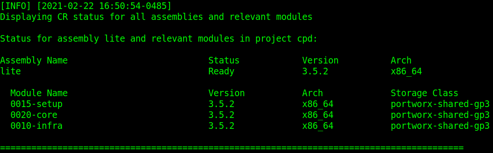

# Install Cloud Pak for Data 3.0.1

## Hardware requirements

-  One computer which will be called **Installer** that runs Linux or MacOS.

## System requirements

- Have completed  [Prepare for Cloud Pak for Data 3.0.1](https://github.com/bpshparis/sandbox/blob/master/Prepare-for-Cloud-Pak-for-Data-3.0.1.md#prepare-for-cloud-pak-for-data-301)
- One **WEB server** where following files are available in **read mode**:
  - [lite-3.0.1-x86_64.tar](https://github.com/bpshparis/sandbox/blob/master/Prepare-for-Cloud-Pak-for-Data-3.0.1.md#save-cloud-pak-for-data-downloads-to-web-server)

<br>
:checkered_flag::checkered_flag::checkered_flag:
<br>

## Install Cloud Pak for Data 3.0.1

> :information_source: Commands below are valid for a **Linux/Centos 7**.

> :warning: Some of commands below will need to be adapted to fit Linux/Debian or MacOS .

### Log in OCP

> :warning: Adapt settings to fit to your environment.

> :information_source: Run this on Installer 

```
LB_HOSTNAME="cli-ocp1"
```

```
oc login https://$LB_HOSTNAME:6443 -u admin -p admin --insecure-skip-tls-verify=true
```

### Create Cloud Pak for Data project

> :warning: Adapt settings to fit to your environment.

> :information_source: Run this on Installer

```
PRJ="cpd"
PRJ_ADMIN="admin"
```
```
oc new-project $PRJ

oc adm policy add-role-to-user cpd-admin-role $PRJ_ADMIN --role-namespace=$(oc project -q) -n $(oc project -q)
```

### Copy Cloud Pak for Data Downloads from web server

> :warning: Adapt settings to fit to your environment.

> :information_source: Run this on Installer 

```
INST_DIR=~/cpd301
ASSEMBLY="lite"
VERSION="3.0.1"
ARCH="x86_64"
TAR_FILE="$ASSEMBLY-$VERSION-$ARCH.tar"
WEB_SERVER_CP_URL="http://web/cloud-pak/assemblies"
```

```
[ -d "$INST_DIR" ] && { rm -rf $INST_DIR; mkdir $INST_DIR; }
cd $INST_DIR

mkdir bin && cd bin
wget -c $WEB_SERVER_CP_URL/$TAR_FILE
tar xvf $TAR_FILE
rm -f $TAR_FILE
```

### Push Cloud Pak for Data images to Openshift registry

> :warning: To avoid network failure, launch installation on locale console or in a screen

> :information_source: Run this on Installer

```
[ ! -z $(command -v screen) ] && echo screen installed || yum install screen -y

pkill screen; screen -mdS ADM && screen -r ADM
```

> :warning: Adapt settings to fit to your environment.

> :information_source: Run this on Installer

```
INST_DIR=~/cpd
ASSEMBLY="lite"
ARCH="x86_64"
VERSION=$(find $INST_DIR/bin/cpd-linux-workspace/assembly/$ASSEMBLY/$ARCH/* -type d | awk -F'/' '{print $NF}')

[ ! -z "$VERSION" ] && echo $VERSION "-> OK" || echo "ERROR: VERSION is not set."
```

```
podman login -u $(oc whoami) -p $(oc whoami -t) $(oc registry info)

$INST_DIR/bin/cpd-linux preloadImages \
--assembly $ASSEMBLY \
--version $VERSION \
--arch $ARCH \
--action push \
--transfer-image-to $(oc registry info)/$(oc project -q) \
--target-registry-password $(oc whoami -t) \
--target-registry-username $(oc whoami) \
--load-from $INST_DIR/bin/cpd-linux-workspace \
--accept-all-licenses
```


### Create Cloud Pak for Data resources on cluster

> :information_source: Run this on Installer

```
$INST_DIR/bin/cpd-linux adm \
--namespace $(oc project -q) \
--assembly $ASSEMBLY \
--version $VERSION \
--arch $ARCH \
--load-from $INST_DIR/bin/cpd-linux-workspace \
--apply \
--accept-all-licenses
```

> :bulb: Check **cpd-admin-sa, cpd-editor-sa and cpd-viewer-sa** services account have been created

```
oc get sa
```

### Install Cloud Pak for Data

> :warning: Adapt settings to fit to your environment.

> :information_source: Run this on Installer

```
SC="portworx-shared-gp3"
INT_REG=$(oc registry info --internal) && echo $INT_REG
OVERRIDE=$INST_DIR/lite-override.yaml
```

```
cat > $OVERRIDE << EOF
zenCoreMetaDb:
  storageClass: portworx-metastoredb-sc
EOF

$INST_DIR/bin/cpd-linux \
--namespace $(oc project -q) \
--assembly $ASSEMBLY \
--version $VERSION \
--arch $ARCH \
--storageclass $SC \
--cluster-pull-prefix $INT_REG/$(oc project -q) \
--load-from $INST_DIR/bin/cpd-linux-workspace \
--override $OVERRIDE \
--accept-all-licenses

```

> :bulb: Check installation progress

```
watch -n5 "oc get pvc && oc get po"
```

### Check Cloud Pak for Data status

> :information_source: Run this on Installer

```
$INST_DIR/bin/cpd-linux status \
--namespace $(oc project -q) \
--assembly $ASSEMBLY \
--arch $ARCH
```




### Access Cloud Pak for Data web console

> :information_source: Run this on Installer

```
oc get routes | awk 'NR==2 {print "Access the web console at https://" $2}'
```

> :bulb: Login as **admin** using **password** for password 

<br>
:checkered_flag::checkered_flag::checkered_flag:
<br>

