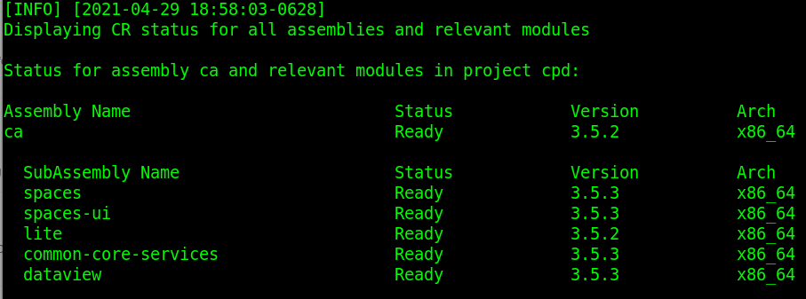
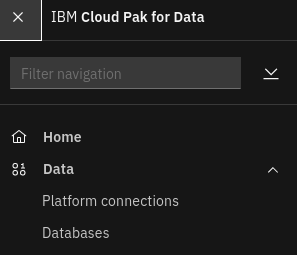
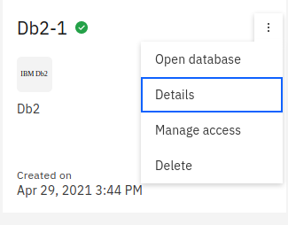
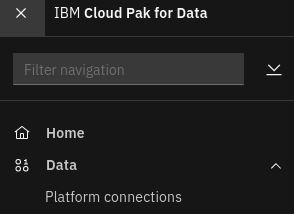
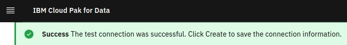

# Install Cognos Analytics

## Hardware requirements

-  One computer which will be called **Installer** that runs Linux.

## System requirements

- Have completed  [Prepare for Cognos Analytics](https://github.com/bpshparis/sandbox/blob/master/Prepare-for-Cognos-Analytics.md#prepare-for-cognos-analytics)
- One **WEB server** where following files are available in **read mode**:
  - [ca-3.5.2-x86_64.tar](https://github.com/bpshparis/sandbox/blob/master/Prepare-for-Cognos-Analytics.md#save-cognos-analytics-downloads-to-web-server)

<br>
:checkered_flag::checkered_flag::checkered_flag:
<br>

## Install Cognos Analytics

> :information_source: Commands below are valid for a **Linux/Centos 7**.

> :warning: Some of commands below will need to be adapted to fit Linux/Debian.

### Log in OCP

> :warning: Adapt settings to fit to your environment.

> :information_source: Run this on Installer 

```
OCP="ocp15"
LB_HOSTNAME="cli-$OCP"
NS="cpd"
```

```
oc login https://$LB_HOSTNAME:6443 -u admin -p admin --insecure-skip-tls-verify=true -n $NS
```

### Copy Cognos Analytics Downloads from web server

> :warning: Adapt settings to fit to your environment.

> :information_source: Run this on Installer 

```
INST_DIR=~/cpd
ASSEMBLY="ca"
VERSION="3.5.2"
ARCH="x86_64"
TAR_FILE="$ASSEMBLY-$VERSION-$ARCH.tar"
WEB_SERVER_CP_URL="http://web/cloud-pak/assemblies"
```

```
[ -d "$INST_DIR" ] && { rm -rf $INST_DIR; mkdir $INST_DIR; } || mkdir $INST_DIR
cd $INST_DIR

wget -c $WEB_SERVER_CP_URL/$TAR_FILE
tar xvf $TAR_FILE
rm -f $TAR_FILE
```

### Push Cognos Analytics images to Openshift registry

> :warning: To avoid network failure, launch installation on locale console or in a screen

> :information_source: Run this on Installer

```
[ ! -z $(command -v screen) ] && echo screen installed || yum install screen -y

pkill screen; screen -mdS ADM && screen -r ADM
```

> :warning: Adapt settings to fit to your environment.

> :information_source: Run this on Installer

```
INST_DIR=~/cpd
ASSEMBLY="ca"
ARCH="x86_64"
VERSION=$(find $INST_DIR/cpd-cli-workspace/assembly/$ASSEMBLY/$ARCH/* -type d | awk -F'/' '{print $NF}')

[ ! -z "$VERSION" ] && echo $VERSION "-> OK" || echo "ERROR: VERSION is not set."
```

```
podman login -u $(oc whoami) -p $(oc whoami -t) $(oc registry info)

$INST_DIR/cpd-cli preload-images \
--assembly $ASSEMBLY \
--arch $ARCH \
--action push \
--transfer-image-to $(oc registry info)/$(oc project -q) \
--target-registry-password $(oc whoami -t) \
--target-registry-username $(oc whoami) \
--load-from $INST_DIR/cpd-cli-workspace \
--accept-all-licenses
```


### Create Cognos Analytics resources on cluster

> :information_source: Run this on Installer

```
$INST_DIR/cpd-cli adm \
--namespace $(oc project -q) \
--assembly $ASSEMBLY \
--arch $ARCH \
--load-from $INST_DIR/cpd-cli-workspace \
--apply \
--latest-dependency \
--accept-all-licenses
```

### Install Cognos Analytics

> :warning: Adapt settings to fit to your environment.

> :information_source: Run this on Installer

```
SC="portworx-shared-gp3"
OVERRIDE_CONFIG="portworx"
INT_REG=$(oc registry info --internal) && echo $INT_REG
```

```
$INST_DIR/cpd-cli install \
--namespace $(oc project -q) \
--assembly $ASSEMBLY \
--arch $ARCH \
--storageclass $SC \
--cluster-pull-prefix $INT_REG/$(oc project -q) \
--load-from $INST_DIR/cpd-cli-workspace \
--override-config $OVERRIDE_CONFIG \
--latest-dependency \
--accept-all-licenses
```

### Check Cognos Analytics status

> :information_source: Run this on Installer

```
$INST_DIR/cpd-cli status \
--namespace $(oc project -q) \
--assembly $ASSEMBLY \
--arch $ARCH
```



### Configuring the content store for Cognos Analytics

#### Update database configuration for Cognos Analytics

##### Log in OCP

> :warning: Adapt settings to fit to your environment.

> :information_source: Run this on Installer

```
LB_HOSTNAME="cli-ocp15"
NS="cpd"
```

```
oc login https://$LB_HOSTNAME:6443 -u admin -p admin --insecure-skip-tls-verify=true -n $NS
```

##### Connect to DB2 Engine pod

> :warning: Adapt settings with what you collected above.

> :information_source: Run this on Installer

```
NS="cpd"
DB2USERNAME="db2inst1"
```


```
DB2_ENGINE_POD=$(oc get pod -n $NS | awk '$1 ~ "db2u-0$" {print $1}') && echo $DB2_ENGINE_POD

oc exec -it $DB2_ENGINE_POD -- bash
```

##### Update Database Configuration for Cognos Analytics

> :information_source: Run this on DB2 Engine pod

```
su - db2inst1
DB_NAME=$(db2 list db directory | awk -F'= ' '$1 ~ "Database name" {print $2}') && echo $DB_NAME

cat > updateConf.db2 << EOF
CONNECT to $DB_NAME; 
UPDATE DATABASE CONFIGURATION USING APPLHEAPSZ 1024 DEFERRED; 
UPDATE DATABASE CONFIGURATION USING LOCKTIMEOUT 240 DEFERRED;
CREATE BUFFERPOOL CMDB_08KBP IMMEDIATE SIZE 1000 PAGESIZE 8K;
CREATE BUFFERPOOL CMDB_32KBP IMMEDIATE SIZE 1000 PAGESIZE 32K;
CREATE SYSTEM TEMPORARY TABLESPACE TSN_SYS_CMDB IN DATABASE PARTITION GROUP IBMTEMPGROUP PAGESIZE 32K BUFFERPOOL CMDB_32KBP;
CREATE USER TEMPORARY TABLESPACE TSN_USR_CMDB IN DATABASE PARTITION GROUP IBMDEFAULTGROUP PAGESIZE 8K BUFFERPOOL CMDB_08KBP;
CREATE REGULAR TABLESPACE TSN_REG_CMDB IN DATABASE PARTITION GROUP IBMDEFAULTGROUP PAGESIZE 8K BUFFERPOOL CMDB_08KBP; 
DROP TABLESPACE USERSPACE1;
ALTER BUFFERPOOL ibmdefaultbp size 49800;
CONNECT reset;
EOF

db2 -v -td\; -f updateConf.db2 -z updateConf.log

exit; exit
```

#### Access Cloud Pak for Data web console

> :information_source: Run this on Installer

```
oc get routes | awk 'NR==2 {print "Access the web console at https://" $2}'
```

> :bulb: Login as **admin** using **password** for password 

#### Collect Database details

> :information_source: Run this on Cloud Pak for Data web console



1. From the navigation, select Data > Databases.

2. Display database details:



3. Collect the following details: 
   - Database name
   - JDBC Connection URL


#### Create the content store connection

> :warning: Adapt settings with what you collected above.

> :information_source: Run this on Cloud Pak for Data web console

> :warning: Get DB2 admin password as explained [here](https://github.com/bpshparis/sandbox/blob/master/Install-Db2-Advanced-Edition.md#updating-the-db2-password)

```
USERNAME="db2inst1"
PASSWORD="password"
HOST="w1-ocp15.iicparis.fr.ibm.com"
PORT="32696"
DATABASE="BLUDB"
```



1. From the navigation menu, select Platform connections.
2. Click **New connection**.
3. Select **Db2** as **Connection type**.
4. Enter a connection name.
5. Set **Host** with **$HOST**.
6. Set **Port** with **$PORT**.
7. Set **Database** with **$DATABASE**.
8. Set **Username** with **$USERNAME**.
9. Set **Password** with **$PASSWORD**.
10. Click **Test connection**.



11. Click **Create**.

#### Provisioning the Cognos Analytics service

> :warning: Adapt settings with what you collected above.

> :information_source: Run this on Cloud Pak for Data web console

1. Browse the catalog of the Cloud Pak for Data web user interface.
2. From the list of services, locate the **Cognos Analytics** service under the **Analytics** category and click on it.
3. Click **Provision instance**.
3. Select **portworx-shared-gp3** for **Shared Volume Storage** and click Next.
4. Select **content store connection created above** for **Content Storage**.
5. Click **Create**.


#### Monitoring service provisioning

##### Log in OCP

> :warning: Adapt settings to fit to your environment.

> :information_source: Run this on Installer 

```
OCP="ocp15"
LB_HOSTNAME="cli-$OCP"
NS="cpd"
```

```
oc login https://$LB_HOSTNAME:6443 -u admin -p admin --insecure-skip-tls-verify=true -n $NS
```

##### Monitoring service provisioning

> :information_source: Run this on Installer 

```
watch -n5 "oc get pvc | grep 'ca' && oc get po | grep 'ca'"
```


<br>
:checkered_flag::checkered_flag::checkered_flag:
<br>

