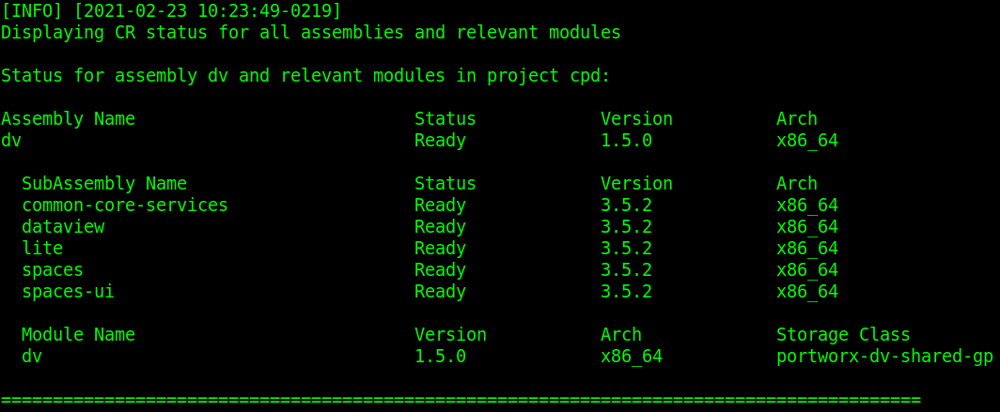
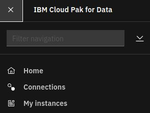

# Install Data Virtualization

## Hardware requirements

-  One computer which will be called **Installer** that runs Linux or MacOS.

## System requirements

- Have completed  [Prepare for Data Virtualization](https://github.com/bpshparis/sandbox/blob/master/Prepare-for-Data-Virtualization.md#prepare-for-data-virtualization)
- One **WEB server** where following files are available in **read mode**:
  - [dv-1.5.0-x86_64.tar](https://github.com/bpshparis/sandbox/blob/master/Prepare-for-Data-Virtualization.md#save-data-virtualization-downloads-to-web-server)

<br>
:checkered_flag::checkered_flag::checkered_flag:
<br>

## Install Data Virtualization

> :information_source: Commands below are valid for a **Linux/Centos 7**.

> :warning: Some of commands below will need to be adapted to fit Linux/Debian or MacOS .

### Log in OCP

> :warning: Adapt settings to fit to your environment.

> :information_source: Run this on Installer 

```
LB_HOSTNAME="cli-ocp13"
NS="cpd"
```

```
oc login https://$LB_HOSTNAME:6443 -u admin -p admin --insecure-skip-tls-verify=true -n $NS
```

### Label worker node for Data Virtualization

> :information_source: Run this on Installer 

```
LABEL="\"dv-dedicated=dv\""
```

```
oc get nodes | awk '$3 ~ "compute|worker" {print "oc label node " $1 " "'$LABEL'" --overwrite"}' | sh
```

>:bulb: Check workers are labelled

```
oc get nodes --show-labels | awk '$3 ~ "compute|worker" {print $1 " -> " $6}'
```

### Copy Data Virtualization Downloads from web server

> :warning: Adapt settings to fit to your environment.

> :information_source: Run this on Installer 

```
INST_DIR=~/cpd
ASSEMBLY="dv"
VERSION="1.5.0"
ARCH="x86_64"
TAR_FILE="$ASSEMBLY-$VERSION-$ARCH.tar"
WEB_SERVER_CP_URL="http://web/cloud-pak/assemblies"
```

```
[ -d "$INST_DIR" ] && { rm -rf $INST_DIR; mkdir $INST_DIR; } || mkdir $INST_DIR
cd $INST_DIR

wget -c $WEB_SERVER_CP_URL/$TAR_FILE
tar xvf $TAR_FILE
rm -f $TAR_FILE
```

### Push Data Virtualization images to Openshift registry

> :warning: To avoid network failure, launch installation on locale console or in a screen

> :information_source: Run this on Installer

```
[ ! -z $(command -v screen) ] && echo screen installed || yum install screen -y

pkill screen; screen -mdS ADM && screen -r ADM
```

> :warning: Adapt settings to fit to your environment.

> :information_source: Run this on Installer

```
INST_DIR=~/cpd
ASSEMBLY="dv"
ARCH="x86_64"
VERSION=$(find $INST_DIR/cpd-cli-workspace/assembly/$ASSEMBLY/$ARCH/* -type d | awk -F'/' '{print $NF}')

[ ! -z "$VERSION" ] && echo $VERSION "-> OK" || echo "ERROR: VERSION is not set."
```

```
podman login -u $(oc whoami) -p $(oc whoami -t) $(oc registry info)

$INST_DIR/cpd-cli preload-images \
--assembly $ASSEMBLY \
--arch $ARCH \
--action push \
--transfer-image-to $(oc registry info)/$(oc project -q) \
--target-registry-password $(oc whoami -t) \
--target-registry-username $(oc whoami) \
--load-from $INST_DIR/cpd-cli-workspace \
--accept-all-licenses
```


### Create Data Virtualization resources on cluster

> :information_source: Run this on Installer

```
$INST_DIR/cpd-cli adm \
--namespace $(oc project -q) \
--assembly $ASSEMBLY \
--arch $ARCH \
--load-from $INST_DIR/cpd-cli-workspace \
--apply \
--latest-dependency \
--accept-all-licenses
```

> :bulb: Check **dv-sa**  and **dv-bar-sa** service accounts have been created

```
oc get sa
```


### Install Data Virtualization

> :warning: Adapt settings to fit to your environment.

> :information_source: Run this on Installer

```
SC="portworx-dv-shared-gp"
INT_REG=$(oc registry info --internal) && echo $INT_REG
```

```
$INST_DIR/cpd-cli install \
--namespace $(oc project -q) \
--assembly $ASSEMBLY \
--arch $ARCH \
--storageclass $SC \
--cluster-pull-prefix $INT_REG/$(oc project -q) \
--load-from $INST_DIR/cpd-cli-workspace \
--override-config portworx \
--latest-dependency \
--accept-all-licenses
```

### Check Data Virtualization status

> :information_source: Run this on Installer

```
$INST_DIR/cpd-cli status \
--namespace $(oc project -q) \
--assembly $ASSEMBLY \
--arch $ARCH
```



<br>
:checkered_flag::checkered_flag::checkered_flag:
<br>

## Provisioning the service

### Access Cloud Pak for Data web console

> :information_source: Run this on Installer

```
oc get routes | awk 'NR==2 {print "Access the web console at https://" $2}'
```

> :bulb: Login as **admin** using **password** for password 

### Provisioning the service

> :information_source: Run this on Cloud Pak for Data web console


1.   Click the Services icon  from the Cloud Pak for Data web user interface.   
2.   From the list of services, locate the **Data Virtualization** service under the Data sources category. Click the action menu and select **Provision instance**.
3.   Leave **kernel semaphore** checkbox **unchecked** (RHCOS kernel is 4.18) 
4.   Keep default value for Nodes.
5.   **Create new claim** with **portworx-dv-shared-gp** as Storage class for both Persistent storage and Cache storage.
6.   Provision the service by clicking **Configure**.

### Monitoring service provisioning

#### Log in OCP

> :warning: Adapt settings to fit to your environment.

> :information_source: Run this on Installer 

```
LB_HOSTNAME="cli-ocp15"
NS="cpd"
```

```
oc login https://$LB_HOSTNAME:6443 -u admin -p admin --insecure-skip-tls-verify=true -n $NS
```

#### Monitoring service provisioning

> :information_source: Run this on Installer 

```
watch -n5 "oc get pvc | grep 'dv' && oc get po | grep 'dv'"
```

### Start working with service

> :information_source: Run this on Cloud Pak for Data web console



1.   From the navigation, select My instances.     

<br>
:checkered_flag::checkered_flag::checkered_flag:
<br>

<!--

```shell
./cpd-cli patch \
--repo ./repo.yaml \
--assembly dv \
--version 1.5.0 \
--patch-name v1.5.0.0-234 \
--action download
```


```shell
frontend dv-nonssl
       bind *:30485
       default_backend dv-nonssl
       mode tcp
       option tcplog
backend dv-nonssl
       balance source
       mode tcp
       server m1-ocp13 172.16.187.131:30485 check
       server m2-ocp13 172.16.187.132:30485 check
       server m3-ocp13 172.16.187.133:30485 check
```

-->