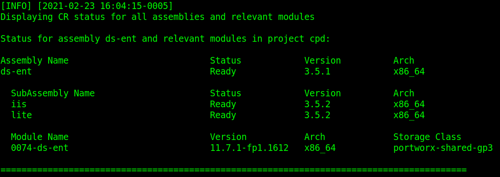
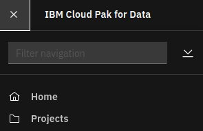

# Install DataStage Edition

## Hardware requirements

-  One computer which will be called **Installer** that runs Linux or MacOS.

## System requirements

- Have completed  [Prepare for DataStage Edition](https://github.com/bpshparis/sandbox/blob/master/Prepare-for-DataStage-Edition.md#prepare-for-datastage-edition)
- One **WEB server** where following files are available in **read mode**:
  - [ds-ent-3.5.1-x86_64.tar](https://github.com/bpshparis/sandbox/blob/master/Prepare-for-DataStage-Edition.md#save-datastage-edition-downloads-to-web-server)

<br>
:checkered_flag::checkered_flag::checkered_flag:
<br>

## Install DataStage Edition

> :information_source: Commands below are valid for a **Linux/Centos 7**.

> :warning: Some of commands below will need to be adapted to fit Linux/Debian or MacOS .

### Log in OCP

> :warning: Adapt settings to fit to your environment.

> :information_source: Run this on Installer 

```
LB_HOSTNAME="cli-ocp15"
NS="cpd"
```

```
oc login https://$LB_HOSTNAME:6443 -u admin -p admin --insecure-skip-tls-verify=true -n $NS
```

### Copy DataStage Edition Downloads from web server

> :warning: Adapt settings to fit to your environment.

> :information_source: Run this on Installer 

```
INST_DIR=~/cpd
ASSEMBLY="ds-ent"
VERSION="3.5.1"
ARCH="x86_64"
TAR_FILE="$ASSEMBLY-$VERSION-$ARCH.tar"
WEB_SERVER_CP_URL="http://web/cloud-pak/assemblies"
```

```
[ -d "$INST_DIR" ] && { rm -rf $INST_DIR; mkdir $INST_DIR; } || mkdir $INST_DIR
cd $INST_DIR

wget -c $WEB_SERVER_CP_URL/$TAR_FILE
tar xvf $TAR_FILE
rm -f $TAR_FILE
```

### Push DataStage Edition images to Openshift registry

> :warning: To avoid network failure, launch installation on locale console or in a screen

> :information_source: Run this on Installer

```
[ ! -z $(command -v screen) ] && echo screen installed || yum install screen -y

pkill screen; screen -mdS ADM && screen -r ADM
```

> :warning: Adapt settings to fit to your environment.

> :information_source: Run this on Installer

```
INST_DIR=~/cpd
ASSEMBLY="ds-ent"
ARCH="x86_64"
VERSION=$(find $INST_DIR/cpd-cli-workspace/assembly/$ASSEMBLY/$ARCH/* -type d | awk -F'/' '{print $NF}')

[ ! -z "$VERSION" ] && echo $VERSION "-> OK" || echo "ERROR: VERSION is not set."
```

```
podman login -u $(oc whoami) -p $(oc whoami -t) $(oc registry info)

$INST_DIR/cpd-cli preload-images \
--assembly $ASSEMBLY \
--arch $ARCH \
--action push \
--transfer-image-to $(oc registry info)/$(oc project -q) \
--target-registry-password $(oc whoami -t) \
--target-registry-username $(oc whoami) \
--load-from $INST_DIR/cpd-cli-workspace \
--accept-all-licenses
```


### Create DataStage Edition resources on cluster

> :information_source: Run this on Installer

```
$INST_DIR/cpd-cli adm \
--namespace $(oc project -q) \
--assembly $ASSEMBLY \
--arch $ARCH \
--load-from $INST_DIR/cpd-cli-workspace \
--apply \
--latest-dependency \
--accept-all-licenses
```

>:bulb: Check **wdp-db2-sa** and **wkc-iis-sa** services account have been created

```
oc get sa
```


### Install DataStage Edition

> :warning: Adapt settings to fit to your environment.

> :information_source: Run this on Installer

```
SC="portworx-shared-gp3"
INT_REG=$(oc registry info --internal) && echo $INT_REG
```

```
$INST_DIR/cpd-cli install \
--namespace $(oc project -q) \
--assembly $ASSEMBLY \
--arch $ARCH \
--storageclass $SC \
--override-config portworx \
--cluster-pull-prefix $INT_REG/$(oc project -q) \
--load-from $INST_DIR/cpd-cli-workspace \
--latest-dependency \
--accept-all-licenses

```

> :bulb: Check installation progress

```
watch -n5 "oc get pvc | egrep -w 'ds|iis|is|kafka|solr' ; oc get po | egrep -w 'ds|iis|is|kafka|solr'"
```


### Check DataStage Edition status

> :information_source: Run this on Installer

```
$INST_DIR/cpd-cli status \
--namespace $(oc project -q) \
--assembly $ASSEMBLY \
--arch $ARCH
```




### Start working with DataStage Edition

#### Access Cloud Pak for Data web console

> :information_source: Run this on Installer

```
oc get routes | awk 'NR==2 {print "Access the web console at https://" $2}'
```

> :bulb: Login as **admin** using **password** for password 


#### Start working with DataStage Edition

> :information_source: Run this on Cloud Pak for Data web console



1.   From the navigation, select Projects.     

> :bulb: If Projects is missing then browse

```
oc get routes | awk 'NR==2 {print "https://" $2 "/zen/#/projectList"}'
```

<br>
:checkered_flag::checkered_flag::checkered_flag:
<br>

