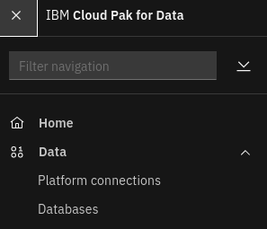
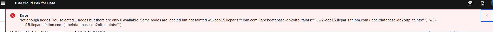

# Install Db2 Advanced Edition

## Hardware requirements

-  One computer which will be called **Installer** that runs Linux or MacOS.

## System requirements

- Have completed  [Prepare for DB2 Advanced Edition](https://github.com/bpshparis/sandbox/blob/master/Prepare-for-DB2-Advanced-Edition.md#prepare-for-db2-advanced-edition)
- One **WEB server** where following files are available in **read mode**:
  - [db2oltp-3.5.4-x86_64.tar](https://github.com/bpshparis/sandbox/blob/master/Prepare-for-DB2-Advanced-Edition.md#save-db2-advanced-edition-downloads-to-web-server)

<br>
:checkered_flag::checkered_flag::checkered_flag:
<br>

## Install Db2 Advanced Edition

> :information_source: Commands below are valid for a **Linux/Centos 7**.

> :warning: Some of commands below will need to be adapted to fit Linux/Debian or MacOS .

### Log in OCP

> :warning: Adapt settings to fit to your environment.

> :information_source: Run this on Installer 

```
OCP="ocp15"
LB_HOSTNAME="cli-$OCP"
NS="cpd"
```

```
oc login https://$LB_HOSTNAME:6443 -u admin -p admin --insecure-skip-tls-verify=true -n $NS
```

### Label worker node for Db2 Advanced Edition

> :information_source: Run this on Installer 

```
LABEL="icp4data=database-db2oltp"
OCP="ocp4"
NODE="w1-$OCP.iicparis.fr.ibm.com" && echo $NODE
```

```
oc label node $NODE $LABEL --overwrite
```

>:bulb: Check worker is labelled

```
oc get node $NODE --show-labels | grep icp4data
```

### Copy Db2 Advanced Edition Downloads from web server

> :warning: Adapt settings to fit to your environment.

> :information_source: Run this on Installer 

```
INST_DIR=~/cpd
ASSEMBLY="db2oltp"
VERSION="3.5.4"
ARCH="x86_64"
TAR_FILE="$ASSEMBLY-$VERSION-$ARCH.tar"
WEB_SERVER_CP_URL="http://web/cloud-pak/assemblies"
```

```
[ -d "$INST_DIR" ] && { rm -rf $INST_DIR; mkdir $INST_DIR; } || mkdir $INST_DIR
cd $INST_DIR

wget -c $WEB_SERVER_CP_URL/$TAR_FILE
tar xvf $TAR_FILE
rm -f $TAR_FILE
```

### Push Db2 Advanced Edition images to Openshift registry

> :warning: To avoid network failure, launch installation on locale console or in a screen

> :information_source: Run this on Installer

```
[ ! -z $(command -v screen) ] && echo screen installed || yum install screen -y

pkill screen; screen -mdS ADM && screen -r ADM
```

> :warning: Adapt settings to fit to your environment.

> :information_source: Run this on Installer

```
INST_DIR=~/cpd
ASSEMBLY="db2oltp"
ARCH="x86_64"
VERSION=$(find $INST_DIR/cpd-cli-workspace/assembly/$ASSEMBLY/$ARCH/* -type d | awk -F'/' '{print $NF}')

[ ! -z "$VERSION" ] && echo $VERSION "-> OK" || echo "ERROR: VERSION is not set."
```

```
podman login -u $(oc whoami) -p $(oc whoami -t) $(oc registry info)

$INST_DIR/cpd-cli preload-images \
--assembly $ASSEMBLY \
--arch $ARCH \
--action push \
--transfer-image-to $(oc registry info)/$(oc project -q) \
--target-registry-password $(oc whoami -t) \
--target-registry-username $(oc whoami) \
--load-from $INST_DIR/cpd-cli-workspace \
--parallelism 5 \
--max-image-retry 1 \
--verbose \
--accept-all-licenses
```


### Create Db2 Advanced Edition resources on cluster

> :information_source: Run this on Installer

```
$INST_DIR/cpd-cli adm \
--namespace $(oc project -q) \
--assembly $ASSEMBLY \
--arch $ARCH \
--load-from $INST_DIR/cpd-cli-workspace \
--apply \
--latest-dependency \
--accept-all-licenses
```

> :bulb: Check **db2u-operator, cpd-databases-sa and db2u** services account have been created

```
oc get sa
```

### Install Db2 Advanced Edition

> :warning: Adapt settings to fit to your environment.

> :information_source: Run this on Installer

```
SC="portworx-shared-gp3"
INT_REG=$(oc registry info --internal) && echo $INT_REG
```

```
$INST_DIR/cpd-cli install \
--namespace $(oc project -q) \
--assembly $ASSEMBLY \
--arch $ARCH \
--storageclass $SC \
--cluster-pull-prefix $INT_REG/$(oc project -q) \
--load-from $INST_DIR/cpd-cli-workspace \
--latest-dependency \
--accept-all-licenses
```

### Check Db2 Advanced Edition status

> :information_source: Run this on Installer

```
$INST_DIR/cpd-cli status \
--namespace $(oc project -q) \
--assembly $ASSEMBLY \
--arch $ARCH
```


<br>
:checkered_flag::checkered_flag::checkered_flag:
<br>

## Creating database

### Access Cloud Pak for Data web console

> :information_source: Run this on Installer

```
oc get routes | awk 'NR==2 {print "Access the web console at https://" $2}'
```

> :bulb: Login as **admin** using **password** for password 

### Creating database

> :information_source: Run this on Cloud Pak for Data web console



1.   From the navigation, select Data > Databases.     
2.   Open the Databases tab, which is only visible after you install the database service.
3.   Click Create a database.
4.   Select the database type and version. Click Next. 

>:bulb: Close the **Not enough nodes** error message



5.   Check **Deploy database on dedicated nodes**.
6.   Value for node label should match label added to workers above (e.g. **database-db2oltp**).

7.   Select **portworx-db2-rwx-sc** for System storage. 
8.   Select **portworx-db2-rwo-sc** for User storage. 
9.   Select **portworx-db2-rwx-sc** for Backup storage. 
10.   Click on **Continue with defaults**. 
11.   (optional) Change Display name to **BLUDB**.
12.   Click on **Create**.


### Monitorin BLUDB database creation

#### Log in OCP

> :warning: Adapt settings to fit to your environment.

> :information_source: Run this on Installer 

```
OCP="ocp15"
LB_HOSTNAME="cli-$OCP"
NS="cpd"
```

```
oc login https://$LB_HOSTNAME:6443 -u admin -p admin --insecure-skip-tls-verify=true -n $NS
```

#### Monitoring BLUDB database creation

> :information_source: Run this on Installer 

```
watch -n5 "oc get pvc | grep 'db2oltp' && oc get po | grep 'db2oltp'"
```

### Check BLUDB database status

> :information_source: Run this on Cloud Pak for Data web console

1.   From the navigation, select Data > Databases.     


### Get the Db2 admin password

```
ASSEMBLY="db2oltp"
NS="cpd"
```

```
SECRET=$(oc get secret -n cpd | egrep -w 'instancepassword' | grep $ASSEMBLY | cut -d ' ' -f 1) && echo $SECRET

[ ! -z $(command -v jq) ] && echo jq installed || yum install jq -y

PASSWD=$(oc get secret $SECRET -n $NS -o json | jq -r .data.password | base64 --decode) && echo $PASSWD
```


### Updating the Db2 admin password

> :information_source: Run this on Installer 

```
OCP="ocp15"
LB_HOSTNAME="cli-$OCP"
NS="cpd"
INSTANCE_NEW_PASSWORD="password" && echo $INSTANCE_NEW_PASSWORD
```

```
oc login https://$LB_HOSTNAME:6443 -u admin -p admin --insecure-skip-tls-verify=true -n $NS

INSTANCE_ID=$(oc get pod | grep db2u-0 | awk -F- '{print $3}') && echo $INSTANCE_ID

SECRET=$(oc get secret -n $NS -o name | grep "$INSTANCE_ID-instancepassword") && echo $SECRET

oc patch -n $NS $SECRET -p '{"data":{"password": "'$(echo $INSTANCE_NEW_PASSWORD | base64)'"}}' --dry-run=client

oc patch -n $NS $SECRET -p '{"data":{"password": "'$(echo $INSTANCE_NEW_PASSWORD | base64)'"}}'

DB2_ENGINE_POD=$(oc get pod | awk '$1 ~ "db2u-0$" {print $1}') && echo $DB2_ENGINE_POD

oc exec -it $DB2_ENGINE_POD -- sudo python <<EOF
import json

with open("/mnt/blumeta0/db2_config/users.json", 'r') as fd:
    parsed = json.load(fd)

if 'db2inst1' in parsed['users']:
    del parsed['users']['db2inst1']

with open("/mnt/blumeta0/db2_config/users.json", 'w') as fd:
    json.dump(parsed, fd, indent=2)
EOF

oc delete po $DB2_ENGINE_POD -n $NS
```
<br>
:checkered_flag::checkered_flag::checkered_flag:
<br>
