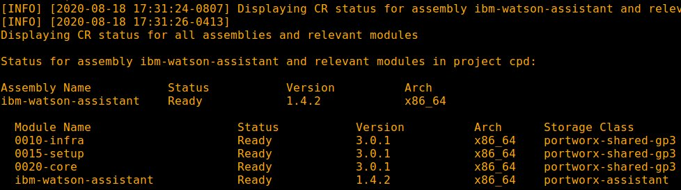

# Install IBM Watson Assistant

## Hardware requirements

-  One computer which will be called **Installer** that runs Linux or MacOS.

## System requirements

- Have completed  [Prepare for IBM Watson Assistant](https://github.com/bpshparis/sandbox/blob/master/Prepare-for-IBM-Watson-Assistant.md#prepare-for-ibm-watson-assistant)
- One **WEB server** where following files are available in **read mode**:
  - [ibm-watson-assistant-1.4.2-x86_64.tar](https://github.com/bpshparis/sandbox/blob/master/Prepare-for-IBM-Watson-Assistant-1.4.2.md#save-ibm-watson-assistant-142-downloads-to-web-server)

<br>
:checkered_flag::checkered_flag::checkered_flag:
<br>

## Install IBM Watson Assistant

> :information_source: Commands below are valid for a **Linux/Centos 7**.

> :warning: Some of commands below will need to be adapted to fit Linux/Debian or MacOS .

### Log in OCP

> :warning: Adapt settings to fit to your environment.

> :information_source: Run this on Installer 

```
LB_HOSTNAME="cli-ocp1"
NS="cpd"
```

```
oc login https://$LB_HOSTNAME:6443 -u admin -p admin --insecure-skip-tls-verify=true -n $NS
```

### Copy IBM Watson Assistant downloads from web server

> :warning: Adapt settings to fit to your environment.

> :information_source: Run this on Installer 

```
INST_DIR=~/cpd301
ASSEMBLY="ibm-watson-assistant"
VERSION="1.4.2"
ARCH="x86_64"
TAR_FILE="$ASSEMBLY-$VERSION-$ARCH.tar"
WEB_SERVER_CP_URL="http://web/cloud-pak/assemblies"
```

```
cd ~
[ -d "$INST_DIR" ] && { rm -rf $INST_DIR; mkdir $INST_DIR; } || mkdir $INST_DIR
cd $INST_DIR

mkdir bin && cd bin
wget -c $WEB_SERVER_CP_URL/$TAR_FILE
tar xvf $TAR_FILE
rm -f $TAR_FILE
```

### Push IBM Watson Assistant images to Openshift registry

> :warning: To avoid network failure, launch installation on locale console or in a screen

> :information_source: Run this on Installer

```
[ ! -z $(command -v screen) ] && echo screen installed || yum install screen -y

pkill screen; screen -mdS ADM && screen -r ADM
```

> :warning: Adapt settings to fit to your environment.

> :information_source: Run this on Installer

```
INST_DIR=~/cpd301
ASSEMBLY="ibm-watson-assistant"
ARCH="x86_64"
VERSION=$(find $INST_DIR/bin/cpd-linux-workspace/assembly/$ASSEMBLY/$ARCH/* -type d | awk -F'/' '{print $NF}')

[ ! -z "$VERSION" ] && echo $VERSION "-> OK" || echo "ERROR: VERSION is not set."

```

```
podman login -u $(oc whoami) -p $(oc whoami -t) $(oc registry info)

$INST_DIR/bin/cpd-linux preloadImages \
--assembly $ASSEMBLY \
--arch $ARCH \
--version $VERSION \
--action push \
--transfer-image-to $(oc registry info)/$(oc project -q) \
--target-registry-password $(oc whoami -t) \
--target-registry-username $(oc whoami) \
--load-from $INST_DIR/bin/cpd-linux-workspace \
--accept-all-licenses
```


### Create IBM Watson Assistant resources on cluster

> :information_source: Run this on Installer

```
$INST_DIR/bin/cpd-linux adm \
--namespace $(oc project -q) \
--assembly $ASSEMBLY \
--version $VERSION \
--arch $ARCH \
--load-from $INST_DIR/bin/cpd-linux-workspace \
--apply \
--accept-all-licenses
```

### Override values for IBM Watson Assistant installation

> :warning: Adapt settings to fit to your environment.

> :information_source: Run this on Installer

```
SECRET=$(oc get secrets | grep default-dockercfg | awk '{print $1}') && echo $SECRET
TYPE="Development"
LANG="french"
OVERRIDE=$(find $INST_DIR/bin/cpd-linux-workspace/modules -type f -exec grep -q "portworx" '{}' \; -print)
[ ! -f "$OVERRIDE" ] && echo "ERROR: OVERRIDE is not a valid file." || echo $OVERRIDE "-> OK"
```

```
sed -i -e 's/\(^\s\{2\}deploymentType:\).*$/\1 "'$TYPE'"/' $OVERRIDE
sed -i -e 's/\(^\s\{4\}pullSecret:\).*$/\1 "'$SECRET'"/' $OVERRIDE
sed -i -e 's/\(^\s\{4\}'$LANG':\).*$/\1 true/' $OVERRIDE

```


### Add the cluster namespace label to IBM Watson Assistant namespace

> :warning: The label is needed to permit communication between IBM Watson Assistant 1.4.2's namespace and the Cloud Pak for Data namespace by using a network policy.

> :information_source: Run this on Installer

```
oc label --overwrite namespace $(oc project -q) ns=$(oc project -q)
oc get namespace $(oc project -q) --show-labels 
```

### Install IBM Watson Assistant

> :warning: Adapt settings to fit to your environment.

> :information_source: Run this on Installer

```
SC="portworx-watson-assistant-sc"
INT_REG=$(oc registry info --internal) && echo $INT_REG
```

```
$INST_DIR/bin/cpd-linux \
--namespace $(oc project -q) \
--assembly $ASSEMBLY \
--version $VERSION \
--arch $ARCH \
--storageclass $SC \
--cluster-pull-prefix $INT_REG/$(oc project -q) \
--load-from $INST_DIR/bin/cpd-linux-workspace \
--override $OVERRIDE \
--accept-all-licenses

```

> :bulb: Check installation progress

```
watch -n5 "oc get pvc | grep 'watson-ass' && oc get po | grep 'watson-ass'"
```

### Check IBM Watson Assistant status

> :information_source: Run this on Installer

```
$INST_DIR/bin/cpd-linux status \
--namespace $(oc project -q) \
--assembly $ASSEMBLY \
--arch $ARCH
```




### Access IBM Watson Assistant web console

> :information_source: Run this on Installer

```
oc get routes | awk 'NR==2 {print "Access the web console at https://" $2}'
```

> :bulb: Login as **admin** using **password** for password 

<br>
:checkered_flag::checkered_flag::checkered_flag:
<br>

