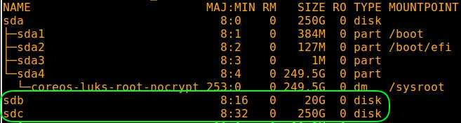
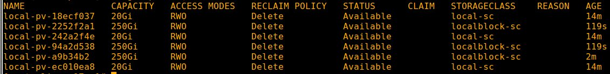

# Install Openshift Container Storage

## Hardware requirements

-  One computer which will be called **Installer** that runs Linux or MacOS.

## System requirements

- One  [OCP 4](https://github.com/bpshparis/sandbox/blob/master/Installing-Redhat-Openshift-4.4-on-Bare-Metal.md#installing-redhat-openshift-4.4-on-bare-metal)

<br>

:checkered_flag::checkered_flag::checkered_flag:

<br>

### Check worker devices availability

> :warning: Adapt settings to fit to your environment.

> :information_source: Run this on Installer

```
OCP="ocp17"
WORKERS_NODES="w1-$OCP w2-$OCP w3-$OCP"
```

```
for node in $WORKERS_NODES; do   ssh -o StrictHostKeyChecking=no -l core $node "hostname; echo '- - -' > /sys/class/scsi_host/host0/scan; lsblk"; done
```

>:bulb: All workers should have **2 raw unformatted disks** each.



> :bulb: Metadata volume (e.g. sdb) will install succesfully if **>= 10 GB**

> :bulb: Application volume (e.g. sdc) will install succesfully if **>= 50 GB**

<br>

:checkered_flag::checkered_flag::checkered_flag:

<br>

### Create persistent storage using local volumes

#### Login to cluster

> :warning: Adapt settings to fit to your environment.

> :information_source: Run this on Installer

```
OC_URL="https://mirror.openshift.com/pub/openshift-v4/clients/ocp/4.4.17/openshift-client-linux-4.4.17.tar.gz"
LB_HOSTNAME="cli-ocp17"
```

```
[ -z $(command -v oc) ] && { wget -c $OC_URL; tar -xvzf $(echo $OC_URL | awk -F'/' '{print $NF}') -C $(echo $PATH | awk -F":" 'NR==1 {print $1}'); oc version; } || { echo "oc and bubectl already installed"; }

oc login https://$LB_HOSTNAME:6443 -u admin -p admin --insecure-skip-tls-verify=true
```

#### Installing Local Storage Operator

> :warning: Adapt settings to fit to your environment.

> :information_source: Run this on Installer

```
NS="local-storage"
CHANNEL_VERSION="4.6"

oc new-project $NS

oc apply -f - << EOF
apiVersion: v1
kind: Namespace
metadata:
  name: local-storage
---
apiVersion: operators.coreos.com/v1alpha2
kind: OperatorGroup
metadata:
  name: local-operator-group
  namespace: local-storage
spec:
  targetNamespaces:
    - local-storage
---
apiVersion: operators.coreos.com/v1alpha1
kind: Subscription
metadata:
  name: local-storage-operator
  namespace: local-storage
spec:
  channel: "$CHANNEL_VERSION" 
  installPlanApproval: Automatic
  name: local-storage-operator
  source: redhat-operators
  sourceNamespace: openshift-marketplace
EOF
```

>:bulb:Check that all the required Pods have been created and the ClusterServiceVersion (CSV) YAML manifest to see that the Local Storage Operator is available in the local-storage project

```
watch -n5 "oc get all -n $NS; oc get csvs -n $NS"
```

#### Get worker nodes yaml list

> :warning: Adapt settings to fit to your environment.

> :information_source: Run this on Installer

```
WORKERS_LIST="workers.yaml"

oc get nodes | awk '$3 ~ "compute|worker" {print "          - " $1 "\r"}' | tee $WORKERS_LIST
```

#### Provision local volumes file system

> :warning: Adapt settings to fit to your environment.

> :information_source: Run this on Installer

```
FS_DEV="/dev/sdc"
FS_RES="local-storage-filesystem.yaml"

cat > $FS_RES << EOF
apiVersion: "local.storage.openshift.io/v1"
kind: "LocalVolume"
metadata:
  name: "local-disks-fs"
  namespace: "local-storage" 
spec:
  nodeSelector: 
    nodeSelectorTerms:
    - matchExpressions:
        - key: kubernetes.io/hostname
          operator: In
          values:
  storageClassDevices:
    - storageClassName: "local-sc"
      volumeMode: Filesystem 
      fsType: xfs 
      devicePaths: 
        - "$FS_DEV"
EOF

sed -i -e '/^\s\{10\}values:/r '$WORKERS_LIST $FS_RES

oc create -f $FS_RES
```

>:bulb:Verify that PersistentVolumes were created, the provisioner was created, and that the corresponding DaemonSets were created

```
watch -n5 "oc get all -n $NS; oc get pv -n $NS"
```

#### Provision local volumes

> :warning: Adapt settings to fit to your environment.

> :information_source: Run this on Installer

```
BLK_DEV="/dev/sdb"
BLK_RES="local-storage.yaml"

cat > $BLK_RES << EOF
apiVersion: "local.storage.openshift.io/v1"
kind: "LocalVolume"
metadata:
  name: "local-disks"
  namespace: "local-storage" 
spec:
  nodeSelector: 
    nodeSelectorTerms:
    - matchExpressions:
        - key: kubernetes.io/hostname
          operator: In
          values:
  storageClassDevices:
    - storageClassName: "localblock-sc"
      volumeMode: Block 
      devicePaths: 
        - "$BLK_DEV"
EOF

sed -i -e '/^\s\{10\}values:/r '$WORKERS_LIST $BLK_RES

oc create -f $BLK_RES
```

>:bulb:Verify that PersistentVolumes were created, the provisioner was created, and that the corresponding DaemonSets were created

```
watch -n5 "oc get all -n $NS; oc get pv -n $NS"
```



<br>

:checkered_flag::checkered_flag::checkered_flag:

<br>

### Install Openshift Container Storage

#### Create openshift-storage namespace 

> :warning: Adapt settings to fit to your environment.

> :information_source: Run this on Installer

```
oc apply -f - << EOF
apiVersion: v1
kind: Namespace
metadata:
  name: openshift-storage
  labels:
    openshift.io/cluster-monitoring: "true"
EOF
```

#### Add label to workers

```
LABEL="\"cluster.ocs.openshift.io/openshift-storage=\""

oc get nodes | awk '$3 ~ "compute|worker" {print "oc label node " $1 " "'$LABEL'" --overwrite"}' | sh
```

#### Installing Red Hat OpenShift Container Storage Operator using the Operator Hub

>:bulb: Get Openshift web console url

```
oc get route -n openshift-console | awk 'NR>1 && $1 ~ "console" {print "https://"$2}'
```

> :information_source: Run this on Openshift web console

1. Click **Operators** → **OperatorHub** in the left pane of the OpenShift Web Console.
2. Search for **OpenShift Container Storage** from the list of operators and click on it.
3. On the OpenShift Container Storage operator page, click **Install**.
4. Keep recommended namespace **openshift-storage** as Installed Namespace.
5. Choose **stable-4.6** option as Update Channel.
6. Choose **Automatic** option as Approval Strategy.
7. Click on **Install**

#### Wait for openshift-storage to be up and running 

> :information_source: Run this on Installer

```
watch -n5 "oc get all -n openshift-storage"
```

#### Create the OCS Cluster Service YAML file

> :information_source: Run this on Installer

```
RES="ocs-cluster-service.yaml"

cat > $RES << EOF
apiVersion: ocs.openshift.io/v1
kind: StorageCluster
metadata:
  name: ocs-storagecluster
  namespace: openshift-storage
spec:
  manageNodes: false
  monPVCTemplate:
    spec:
      accessModes:
      - ReadWriteOnce
      resources:
        requests:
          storage: 10Gi
      storageClassName: 'local-sc'
      volumeMode: Filesystem
  storageDeviceSets:
  - count: 1
    dataPVCTemplate:
      spec:
        accessModes:
        - ReadWriteOnce
        resources:
          requests:
            storage: 100Gi
        storageClassName: 'localblock-sc'
        volumeMode: Block
    name: ocs-deviceset
    placement: {}
    portable: true
    replica: 3
    resources: {}
EOF

oc create -f $RES
```

>:bulb: Monitor resources creation

```
watch -n5 "oc get pvc -n openshift-storage; oc get pv -n openshift-storage"
```

#### Wait for pods to be ready or completed

> :information_source: Run this on Installer

```
watch -n5 "oc get pod -n openshift-storage"
```

#### Add persistent storage to the registry

##### Set default  storageclass

> :information_source: Run this on Installer

```
SC="ocs-storagecluster-cephfs"

oc patch storageclass $SC -p '{"metadata": {"annotations":{"storageclass.kubernetes.io/is-default-class":"true"}}}'
```

##### Remove emptyDir storage

> :information_source: Run this on Installer

```
oc patch configs.imageregistry.operator.openshift.io cluster --type='json' -p='[{"op": "remove", "path": "/spec/storage/emptyDir"}]' --dry-run=client

oc patch configs.imageregistry.operator.openshift.io cluster --type='json' -p='[{"op": "remove", "path": "/spec/storage/emptyDir"}]'
```

##### Add persistent storage to the registry

> :information_source: Run this on Installer

```
oc patch configs.imageregistry.operator.openshift.io cluster --type merge --patch '{"spec":{"storage":{"pvc":{"claim": ""}}}}' --dry-run=client

oc patch configs.imageregistry.operator.openshift.io cluster --type merge --patch '{"spec":{"storage":{"pvc":{"claim": ""}}}}'
```

>:bulb: Check pvc is  created and new pod is running

```
watch -n5 "oc get pod -n openshift-image-registry; oc get pvc -n openshift-image-registry"
```

<br>

:checkered_flag::checkered_flag::checkered_flag:

<br>

