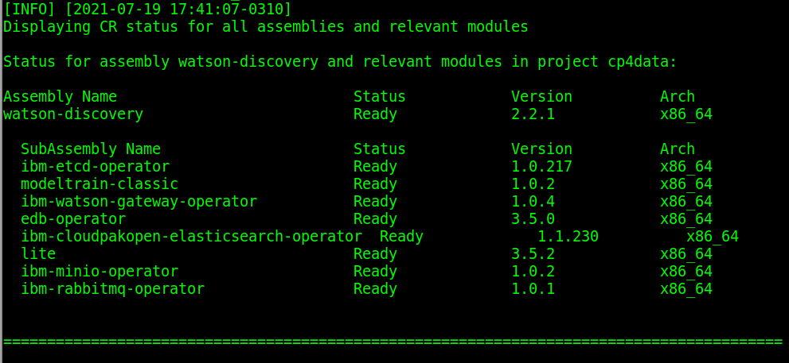

# Install Watson Discovery

## Hardware requirements

-  One computer which will be called **Installer** that runs Linux or MacOS.

## System requirements

- Have completed  [Prepare for Watson Discovery](https://github.com/bpshparis/sandbox/blob/master/Prepare-for-Watson-Discovery.md#prepare-for-watson-discovery)

<br>
:checkered_flag::checkered_flag::checkered_flag:
<br>

## Install Watson Discovery

> :information_source: Commands below are valid for a **Linux/Centos 7**.

> :warning: Some of commands below will need to be adapted to fit Linux/Debian or MacOS .

### Log in OCP

> :warning: Adapt settings to fit to your environment.

> :information_source: Run this on Installer 

```
LB_HOSTNAME="cli-ocp5"
NS="cpd"
```

```
oc login https://$LB_HOSTNAME:6443 -u admin -p admin --insecure-skip-tls-verify=true -n $NS
```

### Push Watson Discovery images to Openshift registry

> :warning: To avoid network failure, launch installation on locale console or in a screen

> :information_source: Run this on Installer

```
[ ! -z $(command -v screen) ] && echo screen installed || yum install screen -y

pkill screen; screen -mdS ADM && screen -r ADM
```

> :warning: Adapt settings to fit to your environment.

> :information_source: Run this on Installer

```
INST_DIR=$(pwd) && echo $INST_DIR
ASSEMBLY="edb-operator"
ARCH="x86_64"
VERSION=$(find $INST_DIR/cpd-cli-workspace/assembly/$ASSEMBLY/$ARCH/* -type d | awk -F'/' '{print $NF}')

[ ! -z "$VERSION" ] && echo $VERSION "-> OK" || echo "ERROR: VERSION is not set."
```

```
podman login -u $(oc whoami) -p $(oc whoami -t) $(oc registry info)

$INST_DIR/cpd-cli preload-images \
--assembly $ASSEMBLY \
--arch $ARCH \
--action push \
--transfer-image-to $(oc registry info)/$(oc project -q) \
--target-registry-password $(oc whoami -t) \
--target-registry-username $(oc whoami) \
--load-from $INST_DIR/cpd-cli-workspace \
--parallelism 5 \
--verbose \
--max-image-retry 1 \
--accept-all-licenses
```


```
INST_DIR=$(pwd) && echo $INST_DIR
ASSEMBLY="watson-discovery"
ARCH="x86_64"
VERSION=$(find $INST_DIR/cpd-cli-workspace/assembly/$ASSEMBLY/$ARCH/* -type d | awk -F'/' '{print $NF}')

[ ! -z "$VERSION" ] && echo $VERSION "-> OK" || echo "ERROR: VERSION is not set."
```

```
podman login -u $(oc whoami) -p $(oc whoami -t) $(oc registry info)

$INST_DIR/cpd-cli preload-images \
--assembly $ASSEMBLY \
--arch $ARCH \
--action push \
--transfer-image-to $(oc registry info)/$(oc project -q) \
--target-registry-password $(oc whoami -t) \
--target-registry-username $(oc whoami) \
--load-from $INST_DIR/cpd-cli-workspace \
--parallelism 5 \
--verbose \
--max-image-retry 1 \
--accept-all-licenses
```


### Create Watson Discovery resources on cluster

> :information_source: Run this on Installer

```
ASSEMBLY="edb-operator"
```

```
$INST_DIR/cpd-cli adm \
--namespace $(oc project -q) \
--assembly $ASSEMBLY \
--arch $ARCH \
--load-from $INST_DIR/cpd-cli-workspace \
--apply \
--latest-dependency \
--accept-all-licenses
```

```
ASSEMBLY="watson-discovery"
```

```
$INST_DIR/cpd-cli adm \
--namespace $(oc project -q) \
--assembly $ASSEMBLY \
--arch $ARCH \
--load-from $INST_DIR/cpd-cli-workspace \
--apply \
--latest-dependency \
--accept-all-licenses
```


### Override values for Watson Discovery installation

> :warning: Adapt settings to fit to your environment.

> :information_source: Run this on Installer

```
cat > install-override.yaml << EOF
---
wdRelease:
  deploymentType: Development
  enableContentIntelligence: false
  elasticsearch:
    clientNode:
      persistence:
        size: 1Gi
    dataNode:
      persistence:
        size: 40Gi
    masterNode:
      persistence:
        size: 2Gi
  etcd:
    storageSize: 10Gi
  minio:
    persistence:
      size: 100Gi
  postgres:
    database:
      storageRequest: 30Gi
    useSingleMountPoint: true
  rabbitmq:
    persistentVolume:
      size: 5Gi
EOF
```

### Install Watson Discovery

> :warning: Adapt settings to fit to your environment.

> :information_source: Run this on Installer

```
OVERRIDE="$PWD/install-override.yaml" && echo $OVERRIDE
SC="portworx-db-gp3-sc" && echo $SC
INT_REG=$(oc registry info --internal) && echo $INT_REG
```

```
$INST_DIR/cpd-cli install \
--namespace $(oc project -q) \
--assembly $ASSEMBLY \
--arch $ARCH \
--storageclass $SC \
--cluster-pull-prefix $INT_REG/$(oc project -q) \
--load-from $INST_DIR/cpd-cli-workspace \
--override $OVERRIDE \
--latest-dependency \
--accept-all-licenses
```

> :bulb: Check installation progress

```
watch -n5 "oc get pvc | grep 'discovery' && oc get po | grep 'discovery'"
```

### Check Watson Discovery status

> :information_source: Run this on Installer

```
$INST_DIR/cpd-cli status \
--namespace $(oc project -q) \
--assembly $ASSEMBLY \
--arch $ARCH
```




### Access Watson Discovery web console

> :information_source: Run this on Installer

```
oc get routes | awk 'NR==2 {print "Access the web console at https://" $2}'
```

> :bulb: Login as **admin** using **password** for password 

<br>
:checkered_flag::checkered_flag::checkered_flag:
<br>

