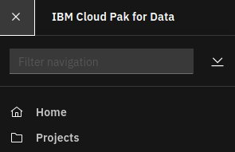

# Install Watson Studio

## Hardware requirements

-  One computer which will be called **Installer** that runs Linux or MacOS.

## System requirements

- Have completed  [Prepare for Watson Studio](https://github.com/bpshparis/sandbox/blob/master/Prepare-for-Watson-Studio.md#prepare-for-watson-studio)
- One **WEB server** where following files are available in **read mode**:
  - [wsl-3.0.1-x86_64.tar](https://github.com/bpshparis/sandbox/blob/master/Prepare-for-Watson-Studio.md#save-watson-studio-downloads-to-web-server)

<br>
:checkered_flag::checkered_flag::checkered_flag:
<br>

## Install Watson Studio

> :information_source: Commands below are valid for a **Linux/Centos 7**.

> :warning: Some of commands below will need to be adapted to fit Linux/Debian or MacOS .

### Log in OCP

> :warning: Adapt settings to fit to your environment.

> :information_source: Run this on Installer 

```
LB_HOSTNAME="cli-ocp15"
NS="cpd"
```

```
oc login https://$LB_HOSTNAME:6443 -u admin -p admin --insecure-skip-tls-verify=true -n $NS
```

### Copy Watson Studio Downloads from web server

> :warning: Adapt settings to fit to your environment.

> :information_source: Run this on Installer 

```
INST_DIR=~/cpd
ASSEMBLY="wsl"
VERSION="3.0.1"
ARCH="x86_64"
TAR_FILE="$ASSEMBLY-$VERSION-$ARCH.tar"
WEB_SERVER_CP_URL="http://web/cloud-pak/assemblies"
```

```
[ -d "$INST_DIR" ] && { rm -rf $INST_DIR; mkdir $INST_DIR; } || mkdir $INST_DIR
cd $INST_DIR

mkdir bin && cd bin
wget -c $WEB_SERVER_CP_URL/$TAR_FILE
tar xvf $TAR_FILE
rm -f $TAR_FILE
```

### Push Watson Studio images to Openshift registry

> :warning: To avoid network failure, launch installation on locale console or in a screen

> :information_source: Run this on Installer

```
[ ! -z $(command -v screen) ] && echo screen installed || yum install screen -y

pkill screen; screen -mdS ADM && screen -r ADM
```

> :warning: Adapt settings to fit to your environment.

> :information_source: Run this on Installer

```
INST_DIR=~/cpd
ASSEMBLY="wsl"
ARCH="x86_64"
VERSION=$(find $INST_DIR/bin/cpd-linux-workspace/assembly/$ASSEMBLY/$ARCH/* -type d | awk -F'/' '{print $NF}')

[ ! -z "$VERSION" ] && echo $VERSION "-> OK" || echo "ERROR: VERSION is not set."
```

```
podman login -u $(oc whoami) -p $(oc whoami -t) $(oc registry info)

$INST_DIR/bin/cpd-linux preloadImages \
--assembly $ASSEMBLY \
--version $VERSION \
--arch $ARCH \
--action push \
--transfer-image-to $(oc registry info)/$(oc project -q) \
--target-registry-password $(oc whoami -t) \
--target-registry-username $(oc whoami) \
--load-from $INST_DIR/bin/cpd-linux-workspace \
--accept-all-licenses
```


### Create Watson Studio resources on cluster

> :information_source: Run this on Installer

```
$INST_DIR/bin/cpd-linux adm \
--namespace $(oc project -q) \
--assembly $ASSEMBLY \
--version $VERSION \
--arch $ARCH \
--load-from $INST_DIR/bin/cpd-linux-workspace \
--apply \
--accept-all-licenses
```

### Prepare for Elasticsearch

> :warning: **vm.max_map_count** has to be set to **262144** for workers.

> :warning: Access to cluster nodes are allowed over ssh as **core** only and only with **ssh public key** which run this [step](https://github.com/bpshparis/sandbox/blob/master/Installing-Redhat-Openshift-4-on-Bare-Metal.md#launch-wait-for-bootstrap-complete)

#### Check

> :warning: Adapt settings to fit to your environment.

> :information_source: Run this on Installer

```
WORKERS="w1-ocp5 w2-ocp5 w3-ocp5"
ROOT_PWD="password"
```

```
for node in $WORKERS; do ssh -o StrictHostKeyChecking=no core@$node 'hostname -f; sysctl -n vm.max_map_count'; done
```

#### Update if necessary

> :information_source: Run this on Installer

```
for node in $WORKERS; do ssh -o StrictHostKeyChecking=no core@$node 'hostname -f; echo '$ROOT_PWD' | sudo passwd root --stdin'; done

for node in $WORKERS; do ssh -o StrictHostKeyChecking=no core@$node 'hostname -f; echo '$ROOT_PWD' | sudo -S sysctl -w vm.max_map_count=262144'; done

for node in $WORKERS; do ssh -o StrictHostKeyChecking=no core@$node 'hostname -f; echo '$ROOT_PWD' | sudo -S chmod 646 /etc/sysctl.conf; ls -Alhtr /etc/sysctl.conf'; done

for node in $WORKERS; do ssh -o StrictHostKeyChecking=no core@$node 'hostname -f; echo "vm.max_map_count=262144" | tee -a /etc/sysctl.conf'; done

for node in $WORKERS; do ssh -o StrictHostKeyChecking=no core@$node 'hostname -f; tail -2 /etc/sysctl.conf'; done

for node in $WORKERS; do ssh -o StrictHostKeyChecking=no core@$node 'hostname -f; echo '$ROOT_PWD' | sudo -S chmod 644 /etc/sysctl.conf; ls -Alhtr /etc/sysctl.conf'; done
```

### Install Watson Studio

> :warning: Adapt settings to fit to your environment.

> :information_source: Run this on Installer

```
SC="portworx-shared-gp3"
INT_REG=$(oc describe pod $(oc get pod -n openshift-image-registry | awk '$1 ~ "image-registry-" {print $1}') -n openshift-image-registry | awk '$1 ~ "REGISTRY_OPENSHIFT_SERVER_ADDR:" {print $2}') && echo $INT_REG
OVERRIDE=$INST_DIR/wsl-override.yaml
```

```
cat > $OVERRIDE << EOF
zenCoreMetaDb:
  storageClass: "portworx-metastoredb-sc"
couchdb:
  persistentVolume:
    storageClass: "portworx-couchdb-sc"
    overrideStorageClass: true
elasticsearch:
  persistence:
    storageClass: "portworx-elastic-sc"
    overrideStorageClass: true
wdp-rabbitmq:
  securityContext:
    fsGroup: 1000320900
  persistentVolume:
    overrideStorageClass: true
    storageClass: "portworx-gp3-sc"
redis-ha:
  persistentVolume:
    overrideStorageClass: true  
    storageClass: "portworx-gp3-sc"
EOF
```

```
$INST_DIR/bin/cpd-linux \
--namespace $(oc project -q) \
--assembly $ASSEMBLY \
--version $VERSION \
--arch $ARCH \
--storageclass $SC \
--cluster-pull-prefix $INT_REG/$(oc project -q) \
--load-from $INST_DIR/bin/cpd-linux-workspace \
--override $OVERRIDE \
--accept-all-licenses

```

> :bulb: Check installation progress

```
watch -n5 "oc get pvc | egrep -w 'wkc|couchdb|cassandra|rabbitmq|elasticsearch|redis' ; oc get po | egrep -w 'wkc|couchdb|cassandra|rabbitmq|elasticsearch|redis|ax|portal'"
```


### Check Watson Studio status

> :information_source: Run this on Installer

```
$INST_DIR/bin/cpd-linux status \
--namespace $(oc project -q) \
--assembly $ASSEMBLY \
--arch $ARCH
```


### Start working with Watson Studio

#### Access Cloud Pak for Data web console

> :information_source: Run this on Installer

```
oc get routes | awk 'NR==2 {print "Access the web console at https://" $2}'
```

> :bulb: Login as **admin** using **password** for password 


#### Start working with Watson Studio

> :information_source: Run this on Cloud Pak for Data web console



1.   From the navigation, select Projects.     

> :bulb: If Projects is missing then browse

```
oc get routes | awk 'NR==2 {print "https://" $2 "/zen/#/projectList"}'
```

<br>
:checkered_flag::checkered_flag::checkered_flag:
<br>

