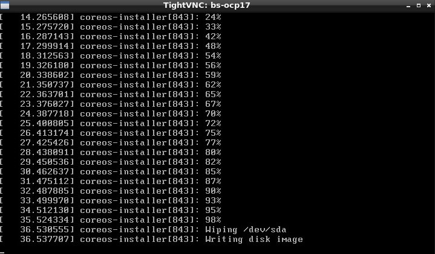
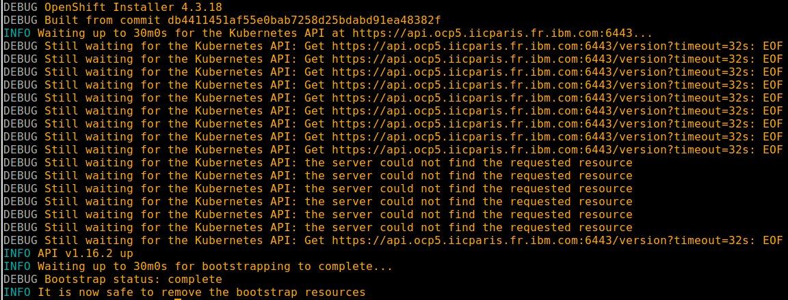
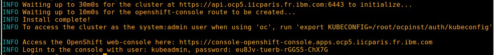
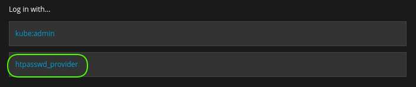

# Installing Redhat Openshift 4 on Bare Metal

This article is *read between lines* of [Installing a cluster on bare metal](https://docs.openshift.com/container-platform/4.3/installing/installing_bare_metal/installing-bare-metal.html).

## Redhat requirements

Be a [Redhat partner](https://partnercenter.redhat.com/Dashboard_page).

Download [Redhat Openshift 4 on Bare Metal material](https://cloud.redhat.com/openshift/install/metal/user-provisioned)

## Hardware requirements

-  One computer which will be called **Installer** that runs Linux or MacOS.
-  One Lenovo **X3550M5** or similar to host **4** virtual machines (bootstrap will be removed after cluster install):

| name                        | role                                              | vcpus  | ram (GB) | storage (GB) | ethernet (10GB) |
| --------------------------- | ------------------------------------------------- | ------ | -------- | ------------ | --------------- |
| m1-ocp5.iicparis.fr.ibm.com | master + etcd                                     | 4      | 16       | 120          | 1               |
| w1-ocp5.iicparis.fr.ibm.com | worker                                            | 16     | 64       | 120          | 1               |
| w2-ocp5.iicparis.fr.ibm.com | worker                                            | 16     | 64       | 120          | 1               |
| w3-ocp5.iicparis.fr.ibm.com | worker                                            | 16     | 64       | 120          | 1               |
| bs-ocp5.iicparis.fr.ibm.com | bootstrap (will be removed after cluster install) | 4      | 16       | 120          | 1               |
| **TOTAL**                   |                                                   | **52** | **208**  | **480**      | **4**           |


## System requirements

- One **VMware vSphere Hypervisor** [5.5](https://my.vmware.com/en/web/vmware/evalcenter?p=free-esxi5), [6.7](https://my.vmware.com/en/web/vmware/evalcenter?p=free-esxi6) or [7.0](https://my.vmware.com/en/web/vmware/evalcenter?p=free-esxi7) with **ESXi Shell access enabled**. VCenter is NOT required.
- One **DNS server**.
- One **Load balancer**.

| Port      | machines                                                     | Description           |
| --------- | ------------------------------------------------------------ | --------------------- |
| 6443      | m1-ocp5.iicparis.fr.ibm.com<br>bs-ocp5.iicparis.fr.ibm.com   | Kubernetes API server |
| 22623 | m1-ocp5.iicparis.fr.ibm.com<br/>bs-ocp5.iicparis.fr.ibm.com  | Machine Config server |
| 443       | w1-ocp5.iicparis.fr.ibm.com<br/>w2-ocp5.iicparis.fr.ibm.com<br/>w3-ocp5.iicparis.fr.ibm.com | HTTPS traffic         |
| 80        | w1-ocp5.iicparis.fr.ibm.com<br/>w2-ocp5.iicparis.fr.ibm.com<br/>w3-ocp5.iicparis.fr.ibm.com | HTTP traffic          |

- One **WEB server** where following files are available in **read mode**:

  - [Openshift pull secret](https://cloud.redhat.com/openshift/install/pull-secret) saved as pull-secret.txt
  - [Linux](https://mirror.openshift.com/pub/openshift-v4/clients/ocp/4.3.33/openshift-install-linux-4.3.33.tar.gz) or [MacOS](https://mirror.openshift.com/pub/openshift-v4/clients/ocp/4.3.33/openshift-install-mac-4.3.33.tar.gz) OpenShift installer
  - [Linux](https://mirror.openshift.com/pub/openshift-v4/clients/ocp/4.3.33/openshift-client-linux-4.3.33.tar.gz) or [MacOS](https://mirror.openshift.com/pub/openshift-v4/clients/ocp/4.3.33/openshift-client-mac-4.3.33.tar.gz) Openshift command line interface
  - [Red Hat Enterprise Linux CoreOS raw image (*rhcos-4.3.33-x86_64-metal.x86_64.raw.gz*)](https://mirror.openshift.com/pub/openshift-v4/dependencies/rhcos/4.3/4.3.33/rhcos-4.3.33-x86_64-metal.x86_64.raw.gz)
  - [Red Hat Enterprise Linux CoreOS iso image (*rhcos-4.3.33-x86_64-installer.x86_64.iso*)](https://mirror.openshift.com/pub/openshift-v4/dependencies/rhcos/4.3/4.3.33/rhcos-4.3.33-x86_64-installer.x86_64.iso)
  - [Openshift installation configuration file (*install-config.yaml*)](scripts/install-config.yaml)
  - [rhcos.vmx](scripts/rhcos.vmx)
  - [createOCP4Cluster.sh](scripts/createOCP4Cluster.sh)
  - [buildIso.sh](scripts/buildIso.sh)

:checkered_flag::checkered_flag::checkered_flag:

## DNS

> :information_source: Commands below are valid for a **bind9** running on a **Ubuntu 16**

### Set environment

> :warning: Adapt settings to fit to your environment

> :information_source: Run this on DNS

```
DOMAIN=$(cat /etc/resolv.conf | awk '$1 ~ "search" {print $2}') && echo $DOMAIN
IP_HEAD="172.16"
OCP=ocp3
CLI_IP=$IP_HEAD.187.30
M1_IP=$IP_HEAD.187.31
W1_IP=$IP_HEAD.187.34
W2_IP=$IP_HEAD.187.35
W3_IP=$IP_HEAD.187.36
BS_IP=$IP_HEAD.187.39
MZONE=/var/lib/bind/$DOMAIN.hosts
RZONE=/var/lib/bind/$IP_HEAD.rev
```
### Add records to master zone

> :information_source: Run this on DNS

```
cat >> $MZONE << EOF
cli-$OCP.$DOMAIN.   IN      A       $CLI_IP
m1-$OCP.$DOMAIN.   IN      A       $M1_IP
w1-$OCP.$DOMAIN.   IN      A       $W1_IP
w2-$OCP.$DOMAIN.   IN      A       $W2_IP
w3-$OCP.$DOMAIN.   IN      A       $W3_IP
bs-$OCP.$DOMAIN.   IN      A       $BS_IP
api.$OCP.$DOMAIN.  IN      A       $CLI_IP
api-int.$OCP.$DOMAIN.      IN      A       $CLI_IP
apps.$OCP.$DOMAIN. IN      A       $CLI_IP
etcd-0.$OCP.$DOMAIN.       IN      A       $M1_IP
*.apps.$OCP.$DOMAIN.       IN      CNAME   apps.$OCP.$DOMAIN.
_etcd-server-ssl._tcp.$OCP.$DOMAIN.        86400   IN      SRV     0 10 2380 etcd-0.$OCP.$DOMAIN.
EOF
```

### Add records to reverse zone

> :information_source: Run this on DNS

```
cat >> $RZONE << EOF
$(echo $CLI_IP | awk -F. '{print $4 "." $3 "." $2 "." $1}').in-addr.arpa.    IN      PTR     cli-$OCP.$DOMAIN.
$(echo $M1_IP | awk -F. '{print $4 "." $3 "." $2 "." $1}').in-addr.arpa.    IN      PTR     m1-$OCP.$DOMAIN.
$(echo $W1_IP | awk -F. '{print $4 "." $3 "." $2 "." $1}').in-addr.arpa.    IN      PTR     w1-$OCP.$DOMAIN.
$(echo $W2_IP | awk -F. '{print $4 "." $3 "." $2 "." $1}').in-addr.arpa.    IN      PTR     w2-$OCP.$DOMAIN.
$(echo $W3_IP | awk -F. '{print $4 "." $3 "." $2 "." $1}').in-addr.arpa.    IN      PTR     w3-$OCP.$DOMAIN.
$(echo $BS_IP | awk -F. '{print $4 "." $3 "." $2 "." $1}').in-addr.arpa.    IN      PTR     bs-$OCP.$DOMAIN.
EOF
```

### Restart DNS service

> :information_source: Run this on DNS

```
service bind9 restart 
```

### Test master zone

> :information_source: Run this on DNS

```
for host in m1 w1 w2 w3 bs; do echo -n $host-$OCP "-> "; dig @localhost +short $host-$OCP.$DOMAIN; done
```

### Test reverse zone

> :information_source: Run this on DNS

```
for host in m1 w1 w2 w3 bs; do IP=$(dig @localhost +short $host-$OCP.$DOMAIN); echo -n $IP "-> "; dig @localhost +short -x $IP; done
```

### Test alias

> :information_source: Run this on DNS

```
dig @localhost +short *.apps.$OCP.iicparis.fr.ibm.com
```

### Test service

> :information_source: Run this on DNS

```
dig @localhost +short _etcd-server-ssl._tcp.$OCP.$DOMAIN SRV
```

:checkered_flag::checkered_flag::checkered_flag:

<br>

## Load balancer

> :information_source: Commands below are valid for a **haproxy** running on a **Centos 7**.

### Set environment

> :warning: Adapt settings to fit to your environment

> :information_source: Run this on Load Balancer

```
OCP="ocp5"
DOMAIN=$(cat /etc/resolv.conf | awk '$1 ~ "^search" {print $2}') && echo $DOMAIN
LB_CONF="/etc/haproxy/haproxy.cfg" && echo $LB_CONF
```

### :bulb: **Optional**: Remove existing config

> :information_source: Run this on Load Balancer

```
sed -i '/^\s\{1,\}maxconn\s\{1,\}3000$/q' $LB_CONF
```

### Configure load balancer

> :information_source: Run this on Load Balancer

```
cat >> $LB_CONF << EOF

listen stats
    bind :9000
    mode http
    stats enable
    stats uri /

frontend ingress-http
    bind *:80
    default_backend ingress-http
    mode tcp
    option tcplog

backend ingress-http
    balance source
    mode tcp
    server w1-$OCP $(dig +short w1-$OCP.$DOMAIN):80 check
    server w2-$OCP $(dig +short w2-$OCP.$DOMAIN):80 check
    server w3-$OCP $(dig +short w3-$OCP.$DOMAIN):80 check

frontend ingress-https
    bind *:443
    default_backend ingress-https
    mode tcp
    option tcplog

backend ingress-https
    balance source
    mode tcp
    server w1-$OCP $(dig +short w1-$OCP.$DOMAIN):443 check
    server w2-$OCP $(dig +short w2-$OCP.$DOMAIN):443 check
    server w3-$OCP $(dig +short w3-$OCP.$DOMAIN):443 check

frontend openshift-api-server
    bind *:6443
    default_backend openshift-api-server
    mode tcp
    option tcplog

backend openshift-api-server
    balance source
    mode tcp
    server m1-$OCP $(dig +short m1-$OCP.$DOMAIN):6443 check
    server bs-$OCP $(dig +short bs-$OCP.$DOMAIN):6443 check

frontend machine-config-server
    bind *:22623
    default_backend machine-config-server
    mode tcp
    option tcplog

backend machine-config-server
    balance source
    mode tcp
    server m1-$OCP $(dig +short m1-$OCP.$DOMAIN):22623 check
    server bs-$OCP $(dig +short bs-$OCP.$DOMAIN):22623 check

EOF
```

### Start  load balancer

> :information_source: Run this on Load Balancer

```
systemctl restart haproxy &&
RC=$(curl -I http://cli-$OCP:9000 | awk 'NR==1 {print $3}') && echo $RC &&
systemctl enable haproxy
```
:checkered_flag::checkered_flag::checkered_flag:


## Prepare installing OCP 4

> :information_source: Commands below are valid for a **Linux/Centos 7**.

> :warning: Some of commands below will need to be adapted to fit Linux/Debian or MacOS .

### Set install-config.yaml

#### Set environment

> :warning: Adapt settings to fit to your environment

> :information_source: Run this on Installer

```
DOMAIN=$(cat /etc/resolv.conf | awk '$1 ~ "^search" {print $2}') && echo $DOMAIN
WEB_SERVER_SOFT_URL="http://web/soft"
INST_DIR=~/ocpinst && echo $INST_DIR
MASTER_COUNT="1"
```

#### Set install-config.yaml

> :information_source: Run this on Installer

```
[ -d "$INST_DIR" ] && { rm -rf $INST_DIR; mkdir $INST_DIR; } || mkdir $INST_DIR
cd $INST_DIR

wget -c $WEB_SERVER_SOFT_URL/install-config.yaml
sed -i "10s/.*/  replicas: $MASTER_COUNT/"  install-config.yaml
sed -i "s/\(^baseDomain: \).*$/\1$DOMAIN/" install-config.yaml
sed -i -e '12s/^  name:.*$/  name: '$OCP'/' install-config.yaml

wget $WEB_SERVER_SOFT_URL/pull-secret.txt
SECRET=$(cat pull-secret.txt) && echo $SECRET
sed -i "s/^pullSecret:.*$/pullSecret: '$SECRET'/"  install-config.yaml

[ ! -f ~/.ssh/id_rsa ] && yes y | ssh-keygen -b 4096 -f ~/.ssh/id_rsa -N ""
PUB_KEY=$(cat ~/.ssh/id_rsa.pub) && echo $PUB_KEY
sed -i "s:^sshKey\:.*$:sshKey\: '$PUB_KEY':"  install-config.yaml 
```

### Backup install-config.yaml on web server

#### Set environment

> :warning: Adapt settings to fit to your environment

> :information_source: Run this on Installer

```
OCP="ocp3"
WEB_SERVER="web"
WEB_SERVER_PATH="/web/$OCP"
```

#### Backup install-config.yaml and ssh keys on web server

> :information_source: Run this on Installer

```
[ -z $(command -v sshpass) ] && yum install -y sshpass || echo "sshpass already installed"

sshpass -e ssh -o StrictHostKeyChecking=no root@$WEB_SERVER "rm -rf $WEB_SERVER_PATH"

sshpass -e ssh -o StrictHostKeyChecking=no root@$WEB_SERVER "mkdir $WEB_SERVER_PATH"

sshpass -e scp -o StrictHostKeyChecking=no install-config.yaml ~/.ssh/id_rsa* root@$WEB_SERVER:$WEB_SERVER_PATH

sshpass -e ssh -o StrictHostKeyChecking=no root@$WEB_SERVER "chmod -R +r $WEB_SERVER_PATH"
```

### Install Openshift installer, oc and kubectl commands

#### Set environment

> :warning: Adapt settings to fit to your environment

> :information_source: Run this on Installer

```
WEB_SERVER_SOFT_URL="http://web/soft"
INSTALLER_FILE="openshift-install-linux-4.3.33.tar.gz"
CLIENT_FILE="openshift-client-linux-4.3.33.tar.gz"
```

#### Install Openshift installer, oc and kubectl commands

> :information_source: Run this on Installer

```
cd $INST_DIR

wget -c $WEB_SERVER_SOFT_URL/$INSTALLER_FILE
tar xvzf $INSTALLER_FILE

wget -c $WEB_SERVER_SOFT_URL/$CLIENT_FILE
tar -xvzf $CLIENT_FILE -C $(echo $PATH | awk -F":" 'NR==1 {print $1}')
oc version
```

### Create manifest and ignition files

> :warning: You have to be on line to execute this steps.

> :information_source: Run this on Installer 

```
cd $INST_DIR

./openshift-install create manifests --dir=$PWD
sed -i 's/mastersSchedulable: true/mastersSchedulable: false/' manifests/cluster-scheduler-02-config.yml

./openshift-install create ignition-configs --dir=$PWD
```

### Make ignition files and RHCOS image available on web server

#### Set environment

> :warning: Adapt settings to fit to your environment

> :information_source: Run this on Installer

```
WEB_SERVER="web"
WEB_SERVER_PATH="/web/$OCP"
RHCOS_IMG_PATH="/web/img/rhcos-4.3.33-x86_64-metal.x86_64.raw.gz"
```

#### Make ignition files and RHCOS image available on web server

> :information_source: Run this on Installer

```
cd $INST_DIR

sshpass -e scp -o StrictHostKeyChecking=no *.ign root@$WEB_SERVER:$WEB_SERVER_PATH

sshpass -e ssh -o StrictHostKeyChecking=no root@$WEB_SERVER "ln -s $RHCOS_IMG_PATH $WEB_SERVER_PATH"

sshpass -e ssh -o StrictHostKeyChecking=no root@web "chmod -R +r /web/$OCP"
```

### Customize RHCOS boot iso

:bulb: The trick is to automate what's explained [here](https://docs.openshift.com/container-platform/4.5/installing/installing_bare_metal/installing-bare-metal.html#installation-user-infra-machines-static-network_installing-bare-metal)

#### Set environment

> :warning: Adapt settings to fit to your environment.

> :information_source: Run this on Installer

```
ESX_SERVER="ocp5"
```


```
WEB_SERVER_ISO_URL="http://web/iso"
RHCOS_ISO_FILE="rhcos-4.3.33-x86_64-installer.x86_64.iso"
ISO_PATH="/media/iso"
RW_ISO_PATH="/media/isorw"
WEB_SERVER_SOFT_URL="http://web/soft"
TEST_ISO_PATH="/media/test"
ESX_ISO_PATH="/vmfs/volumes/datastore1/iso"
```

#### Prepare RHCOS boot iso customization

> :information_source: Run this on Installer

```
wget -c $WEB_SERVER_ISO_URL/$RHCOS_ISO_FILE

[ ! -d $ISO_PATH ] && mkdir $ISO_PATH 

while [ ! -z "$(ls -A $ISO_PATH)" ]; do umount $ISO_PATH; sleep 2; done

mount -o loop $RHCOS_ISO_FILE $ISO_PATH

[ ! -d $RW_ISO_PATH ] && mkdir $RW_ISO_PATH || rm -rf $RW_ISO_PATH/*
```

#### Customize RHCOS boot iso 

> :information_source: Run this on Installer 

```
[ -z $(command -v mkisofs) ] && yum install -y genisoimage || echo -e mkisofs installed
wget -c $WEB_SERVER_SOFT_URL/buildIso.sh
```

> :warning:  Before proceeding, adapt settings in **buildIso.sh**  to fit to your environment.
>
> - **OCP**
> - **WEB_SRV_URL**
> - **RAW_IMG_URL**
> - **DEVICE**
> - **DNS**
> -  **DOMAIN**
> -  **IF**
> - **MASK**
> - **GATEWAY**
> -  **ISO_PATH**
> - **RW_ISO_PATH** 
> - **ISO_CFG**

> :information_source: Run this on Installer 

```
chmod +x buildIso.sh
./buildIso.sh

while [ ! -z "$(ls -A $ISO_PATH)" ]; do umount $ISO_PATH; sleep 2; done
rmdir $ISO_PATH
rm -rf $RW_ISO_PATH
```

#### Check RHCOS boot iso

> :information_source: Run this on Installer 

```
[ ! -d $TEST_ISO_PATH ] && mkdir $TEST_ISO_PATH

for iso in $(ls *.iso); do
    echo $iso
    mount -o loop $iso $TEST_ISO_PATH
    grep 'ip=' $TEST_ISO_PATH/isolinux/isolinux.cfg
    sleep 2
    umount $TEST_ISO_PATH
done

while [ ! -z "$(ls -A $TEST_ISO_PATH)" ]; do umount $TEST_ISO_PATH; sleep 2; done

rmdir $TEST_ISO_PATH
```

#### Make RHCOS boot iso files available on ESX server

> :information_source: Run this on Installer

```
sshpass -e ssh -o StrictHostKeyChecking=no root@$ESX_SERVER "rm -rf $ESX_ISO_PATH/*-$OCP.iso"

sshpass -e scp -o StrictHostKeyChecking=no *-$OCP.iso root@$ESX_SERVER:/$ESX_ISO_PATH

sshpass -e ssh -o StrictHostKeyChecking=no root@$ESX_SERVER "chmod -R +r $ESX_ISO_PATH"
```
:checkered_flag::checkered_flag::checkered_flag:


## Create Cluster

### Set environment

> :warning: Adapt settings to fit to your environment.

> :information_source: Run this on ESX

```
WEB_SERVER_SOFT_URL="http://web/soft"
WEB_SERVER_VMDK_URL="http://web/vmdk"
VMDK_PATH="/vmfs/volumes/datastore1/vmdk/"
```

### Download material

> :information_source: Run this on ESX

```
wget -c $WEB_SERVER_SOFT_URL/createOCP4Cluster.sh
wget -c $WEB_SERVER_VMDK_URL/rhcos.vmx -P $VMDK_PATH
```

### Create cluster nodes

> :bulb: Thanks to ESX VNC integrated server, bootstrap process will be monitorable.<br>
> Change default settings in **createOCP4Cluster.sh** if needed.
>
> -  BOOTSTRAP_VNC_PORT="**5909**"
> -  MASTER_1ST_VNC_PORT="**5901**"
> -  WORKER_1ST_VNC_PORT="**5904**"
> -  VNC_PWD="**password**"

>:warning:  Before proceeding, adapt settings in **createOCP4Cluster.sh** to fit to your environment.
>
>- **OCP**
>- **DATASTORE**
>- **VMS_PATH**
>-  **ISO_PATH** 
>-  **VMX**

> :information_source: Run this on ESX

```
chmod +x ./createOCP4Cluster.sh
./createOCP4Cluster.sh
```
<br>

:checkered_flag::checkered_flag::checkered_flag:

<br>

## [Make a BeforeInstallingOCP snapshot](https://github.com/bpshparis/sandbox/blob/master/Manage-ESX-snapshots.md#manage-esx-snapshots)

<br>

:checkered_flag::checkered_flag::checkered_flag:

<br>


## Start cluster nodes

### Enable VNC on ESX

> :warning: For VNC to work run this on ESX:

> :information_source: Run this on ESX

```
esxcli network firewall ruleset set -e true -r gdbserver
```

### Start cluster nodes

#### Set environment

> :warning: Adapt settings to fit to your environment.

> :information_source: Run this on ESX

```
VM_PATTERN="[mw][1-5]|bs"
```

#### Start cluster nodes

> :information_source: Run this on ESX

```
vim-cmd vmsvc/getallvms | awk '$2 ~ "'$VM_PATTERN'" && $1 !~ "Vmid" {print "vim-cmd vmsvc/power.on " $1}' | sh

watch -n 5 vim-cmd vmsvc/getallvms | awk '$2 ~ "'$VM_PATTERN'" && $1 !~ "Vmid" {print "vim-cmd vmsvc/power.getstate " $1}' | sh
```

> :bulb: Leave watch with **Ctrl + c** when everyone is **powered on**

<br>

:checkered_flag::checkered_flag::checkered_flag:

<br>

## Monitor cluster nodes

### Set environment

> :warning: Adapt settings to fit to your environment.

> :warning: **VNC_PORT** have to match **VNC_PORT** set in **createOCP4Cluster.sh**.

> :information_source: Run this on Installer

```
ESX_SERVER="ocp5"
BS_VNC_PORT=9
M1_VNC_PORT=1
W1_VNC_PORT=4
W2_VNC_PORT=5
W3_VNC_PORT=6
```

>:bulb: Check nodes monitoring display something like




### Monitor bootstrap

> :information_source: Run this on Installer

```
vncviewer $ESX_SERVER:$BS_VNC_PORT
```

### Monitor master

> :information_source: Run this on Installer

```
vncviewer $ESX_SERVER:$M1_VNC_PORT
```

### Monitor worker 1

> :information_source: Run this on Installer

```
vncviewer $ESX_SERVER:$W1_VNC_PORT
```

### Monitor worker 2

> :information_source: Run this on Installer

```
vncviewer $ESX_SERVER:$W2_VNC_PORT
```

### Monitor worker 3

> :information_source: Run this on Installer

```
vncviewer $ESX_SERVER:$W3_VNC_PORT
```

<br>

:checkered_flag::checkered_flag::checkered_flag:

<br>

## Monitor OCP 4 installation

### Launch wait-for-bootstrap-complete

> :warning: Adapt settings to fit to your environment.

> :information_source: Run this on Installer

```
INST_DIR=~/ocpinst
```


```
cd $INST_DIR

> ~/.ssh/known_hosts
eval "$(ssh-agent -s)"
ssh-add ~/.ssh/id_rsa

./openshift-install --dir=$PWD wait-for bootstrap-complete --log-level=debug
```

<br>

:hourglass_flowing_sand: :smoking::coffee::smoking::coffee::smoking::coffee::smoking: :coffee: :hourglass_flowing_sand: :beer::beer::beer::pill:  :zzz::zzz: :zzz::zzz: :zzz::zzz::hourglass_flowing_sand: :smoking::coffee: :toilet: :shower: :smoking: :coffee::smoking: :coffee: :smoking: :coffee: :hourglass: 

<br>

>:bulb: bootstrap complete output



### -  :thumbsup: [Next step](#remove-bootstrap-from-load-balancer)
### -  :thumbsdown: [Troubleshoot wait-for-bootstrap-complete](#troubleshoot-wait-for-bootstrap-complete)
### -  :thumbsdown: [Revert snapshot](https://github.com/bpshparis/sandbox/blob/master/Manage-ESX-snapshots.md#manage-esx-snapshots)

### Troubleshoot wait-for-bootstrap-complete

> :warning: Adapt settings to fit to your environment.

> :information_source: Run this on Installer

```
INST_DIR=~/ocpinst
BS_IP="172.16.187.59"
M1_IP="172.16.187.51"
```


```
cd $INST_DIR
./openshift-install gather bootstrap --bootstrap $BS_IP --key ~/.ssh/id_rsa --master "$M1_IP"
```

### -  [Revert snapshot](https://github.com/bpshparis/sandbox/blob/master/Manage-ESX-snapshots.md#manage-esx-snapshots)

<br>

:checkered_flag::checkered_flag::checkered_flag:

<br>

### Remove bootstrap from load balancer

> :warning: Adapt settings to fit to your environment.

> :information_source: Run this on Load Balancer

```
LB_CONF="/etc/haproxy/haproxy.cfg" && echo $LB_CONF
BS_PATTERN="server bs-"
```

```
sed -i -e 's/\('"$BS_PATTERN"'*\)/# \1/g' $LB_CONF
systemctl restart haproxy
```
<br>

:checkered_flag::checkered_flag::checkered_flag:

<br>

### Login to cluster as system:admin

> :warning: Adapt settings to fit to your environment.

> :information_source: Run this on Installer

```
INST_DIR=~/ocpinst
```

```
export KUBECONFIG=$INST_DIR/auth/kubeconfig
oc whoami
```

>:warning: Launch command until following errors are displayed

- Unable to connect to the server: EOF
- Error from server (NotFound): the server could not find the requested resource (get users.user.openshift.io ~)

>:bulb: Last command above should return **system:admin**


### Approve CSRs for nodes

> :warning: Confirm that the cluster recognizes all nodes.

> :information_source: Run this on Installer

```
oc get nodes
```

> :warning: If nodes are missing then approve csrs until all nodes are displayed (**even if NotReady**)

```
oc get csr -o go-template='{{range .items}}{{if not .status}}{{.metadata.name}}{{"\n"}}{{end}}{{end}}' | xargs oc adm certificate approve

oc get nodes
```

### Check Operator configuration

> :information_source: Run this on Installer

```
watch -n5 oc get clusteroperators
```

> :warning: Wait for **AVAILABLE** column to be set to true for all operators

<br>

:hourglass_flowing_sand: :smoking::coffee::smoking::coffee::smoking::coffee::smoking: :coffee: :hourglass_flowing_sand: :beer::beer::beer::pill:  :zzz::zzz: :zzz::zzz: :zzz::zzz::hourglass_flowing_sand: :smoking::coffee: :toilet: :shower: :smoking: :coffee::smoking: :coffee: :smoking: :coffee: :hourglass: 

<br>


### Launch wait-for-install-complete

> :warning: Adapt settings to fit to your environment.

> :information_source: Run this on Installer

```
INST_DIR=~/ocpinst
```

```
cd $INST_DIR
./openshift-install --dir=$PWD wait-for install-complete --log-level=debug
```

>:bulb: install complete output




### -  :thumbsup: [Next step](#post-install-ocp-4)
### -  :thumbsdown: [Revert snapshot](https://github.com/bpshparis/sandbox/blob/master/Manage-ESX-snapshots.md#manage-esx-snapshots)

<br>

:checkered_flag::checkered_flag::checkered_flag:

<br>

## Post install OCP 4

### Login to cluster as system:admin

> :warning: Adapt settings to fit to your environment.

> :information_source: Run this on Installer

```
INST_DIR=~/ocpinst
```

```
export KUBECONFIG=$INST_DIR/auth/kubeconfig
oc whoami
```
>:bulb: Command above should return **system:admin**

### Create an admin user with cluster-admin role

> :warning: Adapt settings to fit to your environment.

> :information_source: Run this on Installer

```
INST_DIR=~/ocpinst
```

```
cd $INST_DIR
[ -z $(command -v htpasswd) ] && yum install -y httpd-tools || echo "htpasswd already installed"

htpasswd -c -B -b admin.htpasswd admin admin                     

oc create secret generic admin-secret --from-file=htpasswd=$INST_DIR/admin.htpasswd  -n openshift-config

oc apply -f - << EOF
apiVersion: config.openshift.io/v1
kind: OAuth
metadata:
  name: cluster
spec:
  identityProviders:
  - name: htpasswd_provider 
    mappingMethod: claim 
    type: HTPasswd
    htpasswd:
      fileData:
        name: admin-secret
  tokenConfig:
    accessTokenMaxAgeSeconds: 31536000         
EOF

sleep 10
oc adm policy add-cluster-role-to-user cluster-admin admin
```

### Login to cluster as admin

> :warning: Adapt settings to fit to your environment.

> :information_source: Run this on Installer

```
LB_HOSTNAME="cli-ocp5"
```

```
oc login https://$LB_HOSTNAME:6443 -u admin -p admin --insecure-skip-tls-verify=true
```

### Set etcd-quorum-guard to unmanaged state

> :warning: Apply patch only if you set **MASTER_COUNT** above to **1**

> :information_source: Run this on Installer

```
oc patch clusterversion/version --type='merge' -p "$(cat <<- EOF
spec:
  overrides:
    - group: apps/v1
      kind: Deployment
      name: etcd-quorum-guard
      namespace: openshift-machine-config-operator
      unmanaged: true
EOF
)"
```

### Downscale etcd-quorum-guard to one

> :warning: Apply scale only if you set **MASTER_COUNT** above to **1**

> :information_source: Run this on Installer

```
oc scale --replicas=1 deployment/etcd-quorum-guard -n openshift-machine-config-operator
```

### Setup image-registry to use ephemeral storage

> :information_source: Run this on Installer

```
oc patch configs.imageregistry.operator.openshift.io cluster --type merge --patch '{"spec":{"storage":{"emptyDir":{}}}}'

oc patch configs.imageregistry.operator.openshift.io cluster --type merge --patch '{"spec":{"managementState":"Managed"}}'
```

>:bulb: Wait until the image-registry operator completes the update before using the registry.

>:bulb:  **3rd column should be == true**

```
watch -n5 "oc get clusteroperators | grep registry"
```

<br>

:checkered_flag::checkered_flag::checkered_flag:

<br>

## Test OCP 4

> :information_source: Run this on Installer

```
oc new-project validate

oc new-app django-psql-example

sleep 120

oc logs -f bc/django-psql-example
```

>:bulb: Wait until **Successfully pushed image-registry.openshift-image-registry.svc:5000/validate/django-psql-example**

```
oc get routes | awk 'NR>1 {print "\nTo access your application, Visit url:\n"$2}'
```

### Extract OCP 4 web console CA

> :warning: Adapt settings to fit to your environment.

> :information_source: Run this on Installer

```
LB_HOSTNAME="cli-ocp5"
```

```
oc login https://$LB_HOSTNAME:6443 -u admin -p admin --insecure-skip-tls-verify=true

[ -z "$(command -v openssl)" ] && yum install -y openssl || echo "openssl already installed"

CONSOLE_HOSTNAME=$(oc get routes -n openshift-console | awk '$2 ~ "console-" {print $2}')

CERT_COUNT=$(openssl s_client -showcerts -connect $CONSOLE_HOSTNAME:443  </dev/null | grep -c 'BEGIN CERTIFICATE')

openssl s_client -showcerts -connect $CONSOLE_HOSTNAME:443  </dev/null | awk '/BEGIN CERTIFICATE/&&++k=='$CERT_COUNT',/END CERTIFICATE/' > $CONSOLE_HOSTNAME.crt

[ -z "$(openssl x509 -noout -text -in  $CONSOLE_HOSTNAME.crt | grep  CA:TRUE)" ] && echo "ERROR:" $CONSOLE_HOSTNAME.crt "is not a valid CA" || echo "OK:" $CONSOLE_HOSTNAME.crt "is a valid CA"
```

>:bulb: Add **$CONSOLE_HOSTNAME.crt** to Authorities in your **web browser Certificate Manager**


### Get OCP 4 web console url and login

> :information_source: Run this on Installer

```
oc get route -n openshift-console | awk 'NR>1 && $1 ~ "console" {print "\nWeb Console is available with htpasswd_provider as admin with admin as password at:\nhttps://"$2}'
```

>:bulb: Login with htpasswd_provider



<br>

:checkered_flag::checkered_flag::checkered_flag:

<br>

## Remove bootstrap

### Remove bootstrap VM

#### Set environment

> :warning: Adapt settings to fit to your environment.

> :information_source: Run this on ESX

```
VM_PATTERN="bs"
```
#### Remove bootstrap VM

> :information_source: Run this on ESX

```
vim-cmd vmsvc/getallvms | awk '$2 ~ "'$VM_PATTERN'" && $1 !~ "Vmid" {print "vim-cmd vmsvc/power.off " $1}' | sh

watch -n 10 vim-cmd vmsvc/getallvms | awk '$2 ~ "'$VM_PATTERN'" && $1 !~ "Vmid" {print "vim-cmd vmsvc/power.getstate " $1}' | sh
```

> :bulb: Leave watch with **Ctrl + c** when bootstrap is **powered off**

```
vim-cmd vmsvc/getallvms | awk '$2 ~ "'$VM_PATTERN'" && $1 !~ "Vmid" {print "vim-cmd vmsvc/destroy " $1}' | sh
```

<br>

:checkered_flag::checkered_flag::checkered_flag:

<br>

> :warning: Wait for at least **24** hours before taking a valid snapshot

>:bulb: Check cluster age

```
oc get nodes | awk 'NR==2 {print $4}'
```

### -  [Take snapshot](https://github.com/bpshparis/sandbox/blob/master/Manage-ESX-snapshots.md#manage-esx-snapshots)


<!--

Administration > Cluster Settings > Global Configuration > Alertmanager
Create receiver named receiver0
Choose PagerDuty for Receiver Type
Choose Events API v2 from Integration Type
Choose password from Routing Key
Choose severity for Routing Labels NAME
Choose warning for Routing Labels VALUE
Hit save button
Save YAML in YAML tab -> alertmanager-main has been updated to version 41453 

https://docs.openshift.com/container-platform/4.4/applications/pruning-objects.html#pruning-images_pruning-objects

oc edit imagepruners.imageregistry.operator.openshift.io/cluster
change spec:suspend from true to false

https://docs.openshift.com/container-platform/4.4/operators/olm-understanding-operatorhub.html#olm-operatorhub-arch-operatorhub_crd_olm-understanding-operatorhub

oc edit OperatorHub cluster
add spec:disableAllDefaultSources: true

spec:

  disableAllDefaultSources: true


-->

