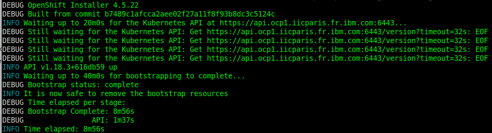
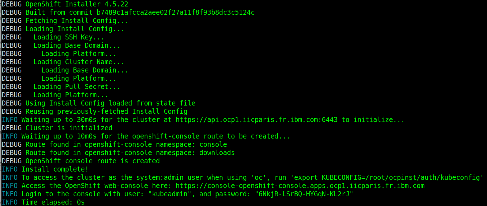
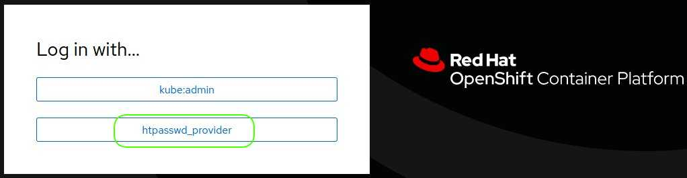

# Installing Redhat Openshift on Bare Metal

This article is *read between lines* of [Installing a cluster on bare metal / any platform](https://docs.openshift.com/container-platform/4.6/installing/installing_platform_agnostic/installing-platform-agnostic.html).

## Redhat requirements

Be a [Redhat partner](https://partnercenter.redhat.com/Dashboard_page).

Download [Redhat Openshift 4 on Bare Metal material](https://cloud.redhat.com/openshift/install/metal/user-provisioned)

## Hardware requirements

-  One computer which will be called **Installer** that runs Linux or MacOS.
-  One Lenovo **X3550M5** or similar to host **6** virtual machines (bootstrap will be removed after cluster install):

| name                        | role                                              | vcpus  | ram (GB) | storage (GB)    | ethernet (10GB) |
| --------------------------- | ------------------------------------------------- | ------ | -------- | --------------- | --------------- |
| m1-ocp1.iicparis.fr.ibm.com | master + etcd                                     | 4      | 16       | 250             | 1               |
| m2-ocp1.iicparis.fr.ibm.com | master + etcd                                     | 4      | 16       | 250             | 1               |
| m3-ocp1.iicparis.fr.ibm.com | master + etcd                                     | 4      | 16       | 250             | 1               |
| w1-ocp1.iicparis.fr.ibm.com | worker                                            | 16     | 64       | 250 + 250 + 100 | 1               |
| w2-ocp1.iicparis.fr.ibm.com | worker                                            | 16     | 64       | 250 + 250 + 100 | 1               |
| w3-ocp1.iicparis.fr.ibm.com | worker                                            | 16     | 64       | 250 + 250 + 100 | 1               |
| bs-ocp1.iicparis.fr.ibm.com | bootstrap (will be removed after cluster install) | 4      | 16       | 120             | 1               |
| **TOTAL**                   |                                                   | **60** | **240**  | **2550**        | **6**           |


> :bulb: Additional storage for workers (e.g. **100 + 250**) will be needed as unformated/raw partitions (e.g. **/dev/sdb, /dev/sdc**) to install block storage cluster such as Portworx or Openshift Cloud Storage (OCS). 


## System requirements

- One **VMware vSphere Hypervisor** [5.5](https://my.vmware.com/en/web/vmware/evalcenter?p=free-esxi5), [6.7](https://my.vmware.com/en/web/vmware/evalcenter?p=free-esxi6) or [7.0](https://my.vmware.com/en/web/vmware/evalcenter?p=free-esxi7) with **ESXi Shell access enabled**. VCenter is NOT required.
- One **DNS server**.
- One **Load balancer**.

| Port      | machines                                                     | Description           |
| --------- | ------------------------------------------------------------ | --------------------- |
| 6443      | m1-ocp1.iicparis.fr.ibm.com<br>m2-ocp1.iicparis.fr.ibm.com<br/>m3-ocp1.iicparis.fr.ibm.com<br/>bs-ocp1.iicparis.fr.ibm.com | Kubernetes API server |
| 22623 | m1-ocp1.iicparis.fr.ibm.com<br/>m2-ocp1.iicparis.fr.ibm.com<br/>m3-ocp1.iicparis.fr.ibm.com<br/>bs-ocp1.iicparis.fr.ibm.com | Machine Config server |
| 443       | w1-ocp1.iicparis.fr.ibm.com<br/>w2-ocp1.iicparis.fr.ibm.com<br/>w3-ocp1.iicparis.fr.ibm.com | HTTPS traffic         |
| 80        | w1-ocp1.iicparis.fr.ibm.com<br/>w2-ocp1.iicparis.fr.ibm.com<br/>w3-ocp1.iicparis.fr.ibm.com | HTTP traffic          |

- One **WEB server** where following files are available in **read mode**:

  - [Openshift pull secret](https://cloud.redhat.com/openshift/install/pull-secret) saved as pull-secret.txt
  - [Linux](https://mirror.openshift.com/pub/openshift-v4/clients/ocp/latest-4.6/openshift-install-linux.tar.gz) OpenShift installer
  - [Linux](https://mirror.openshift.com/pub/openshift-v4/clients/ocp/stable/openshift-client-linux.tar.gz) Openshift command line interface
  - [Red Hat Enterprise Linux CoreOS raw image](https://mirror.openshift.com/pub/openshift-v4/dependencies/rhcos/4.10/latest/rhcos-metal.x86_64.raw.gz)
  - [Red Hat Enterprise Linux CoreOS iso image](https://mirror.openshift.com/pub/openshift-v4/dependencies/rhcos/4.5/latest/rhcos-installer.x86_64.iso)
  - [Openshift installation configuration file (*install-config.yaml*)](scripts/install-config.yaml)
  - [rhcos.vmx](scripts/rhcos.vmx)
  - [createOCP4Cluster.sh](scripts/createOCP4Cluster.sh)
  - [buildIso.sh](scripts/buildIso.sh)

:checkered_flag::checkered_flag::checkered_flag:

## WEB server

> :bulb: If needed, install a [WEB server](NGINX.md)

## DNS

> :bulb: If needed, install a [DNS](DNS.md)

> :information_source: Commands below are valid for a **bind** running on a **Centos 7**.

### Set environment

> :warning: Adapt settings to fit to your environment

> :information_source: Run this on DNS

```
DOMAIN=$(cat /etc/resolv.conf | awk '$1 ~ "search" {print $2}') && echo $DOMAIN
IP_HEAD="172.16" && echo $IP_HEAD
OCP="ocp14"
DNS="172.16.160.100"
NUM="$(echo $OCP | awk -F'ocp' '{print $2}')" && echo $NUM
LB_IP=$IP_HEAD.187.${NUM}0 && echo $LB_IP
M1_IP=$IP_HEAD.187.${NUM}1 && echo $M1_IP
M2_IP=$IP_HEAD.187.${NUM}2 && echo $M2_IP
M3_IP=$IP_HEAD.187.${NUM}3 && echo $M3_IP
W1_IP=$IP_HEAD.187.${NUM}4 && echo $W1_IP
W2_IP=$IP_HEAD.187.${NUM}5 && echo $W2_IP
W3_IP=$IP_HEAD.187.${NUM}6 && echo $W3_IP
W4_IP=$IP_HEAD.187.${NUM}7 && echo $W4_IP
W5_IP=$IP_HEAD.187.${NUM}8 && echo $W5_IP
BS_IP=$IP_HEAD.187.${NUM}9 && echo $BS_IP
MZONE=/var/lib/bind/$DOMAIN.hosts
RZONE=/var/lib/bind/$IP_HEAD.rev
```
### Add records to master zone

> :information_source: Run this on DNS

```
cat >> $MZONE << EOF
m1.$OCP.$DOMAIN.   IN      A       $M1_IP
m2.$OCP.$DOMAIN.   IN      A       $M2_IP
m3.$OCP.$DOMAIN.   IN      A       $M3_IP
w1.$OCP.$DOMAIN.   IN      A       $W1_IP
w2.$OCP.$DOMAIN.   IN      A       $W2_IP
w3.$OCP.$DOMAIN.   IN      A       $W3_IP
w4.$OCP.$DOMAIN.   IN      A       $W4_IP
w5.$OCP.$DOMAIN.   IN      A       $W5_IP
bs.$OCP.$DOMAIN.   IN      A       $BS_IP
api.$OCP.$DOMAIN.  IN      A       $LB_IP
api-int.$OCP.$DOMAIN.      IN      A       $LB_IP
apps.$OCP.$DOMAIN. IN      A       $LB_IP
etcd-0.$OCP.$DOMAIN.       IN      A       $M1_IP
etcd-1.$OCP.$DOMAIN.       IN      A       $M2_IP
etcd-2.$OCP.$DOMAIN.       IN      A       $M3_IP
*.apps.$OCP.$DOMAIN.       IN      CNAME   apps.$OCP.$DOMAIN.
_etcd-server-ssl._tcp.$OCP.$DOMAIN.        86400   IN      SRV     0 10 2380 etcd-0.$OCP.$DOMAIN.
_etcd-server-ssl._tcp.$OCP.$DOMAIN.        86400   IN      SRV     0 10 2380 etcd-1.$OCP.$DOMAIN.
_etcd-server-ssl._tcp.$OCP.$DOMAIN.        86400   IN      SRV     0 10 2380 etcd-2.$OCP.$DOMAIN.
EOF
```

### Add records to reverse zone

> :information_source: Run this on DNS

```
cat >> $RZONE << EOF
$(echo $M1_IP | awk -F. '{print $4 "." $3 "." $2 "." $1}').in-addr.arpa.    IN      PTR     m1.$OCP.$DOMAIN.
$(echo $M2_IP | awk -F. '{print $4 "." $3 "." $2 "." $1}').in-addr.arpa.    IN      PTR     m2.$OCP.$DOMAIN.
$(echo $M3_IP | awk -F. '{print $4 "." $3 "." $2 "." $1}').in-addr.arpa.    IN      PTR     m3.$OCP.$DOMAIN.
$(echo $W1_IP | awk -F. '{print $4 "." $3 "." $2 "." $1}').in-addr.arpa.    IN      PTR     w1.$OCP.$DOMAIN.
$(echo $W2_IP | awk -F. '{print $4 "." $3 "." $2 "." $1}').in-addr.arpa.    IN      PTR     w2.$OCP.$DOMAIN.
$(echo $W3_IP | awk -F. '{print $4 "." $3 "." $2 "." $1}').in-addr.arpa.    IN      PTR     w3.$OCP.$DOMAIN.
$(echo $W4_IP | awk -F. '{print $4 "." $3 "." $2 "." $1}').in-addr.arpa.    IN      PTR     w4.$OCP.$DOMAIN.
$(echo $W5_IP | awk -F. '{print $4 "." $3 "." $2 "." $1}').in-addr.arpa.    IN      PTR     w5.$OCP.$DOMAIN.
$(echo $BS_IP | awk -F. '{print $4 "." $3 "." $2 "." $1}').in-addr.arpa.    IN      PTR     bs.$OCP.$DOMAIN.
EOF
```

### Restart DNS service

> :information_source: Run this on DNS

```
systemctl restart named 
```

### Test master zone

> :information_source: Run this on DNS

```
for host in m1 m2 m3 w1 w2 w3 w4 w5 bs; do echo -n $host.$OCP "-> "; dig @$DNS +short $host.$OCP.$DOMAIN; done
```

### Test reverse zone

> :information_source: Run this on DNS

```
for host in m1 m2 m3 w1 w2 w3 w4 w5 bs; do IP=$(dig @$DNS +short $host.$OCP.$DOMAIN); echo -n $IP "-> "; dig @$DNS +short -x $IP; done
```

### Test alias

> :information_source: Run this on DNS

```
dig @$DNS +short *.apps.$OCP.$DOMAIN
```

### Test service

> :information_source: Run this on DNS

```
dig @$DNS +short _etcd-server-ssl._tcp.$OCP.$DOMAIN SRV
```

:checkered_flag::checkered_flag::checkered_flag:

<br>

## Load balancer

> :information_source: Commands below are valid for a **haproxy** running on a **Centos 7**.

### Set environment

> :warning: Adapt settings to fit to your environment

> :information_source: Run this on Load Balancer

```
OCP="ocp14"
DOMAIN=$(cat /etc/resolv.conf | awk '$1 ~ "^search" {print $2}') && echo $DOMAIN
LB_CONF="/etc/haproxy/haproxy.cfg" && echo $LB_CONF
[ -f "$LB_CONF" ] && echo "haproxy already installed" || sudo yum install haproxy -y
```

### :bulb: **Optional**: Remove existing config

> :information_source: Run this on Load Balancer

```
sudo sed -i '/^\s\{1,\}maxconn\s\{1,\}3000$/q' $LB_CONF
```

### Configure load balancer

> :information_source: Run this on Load Balancer

```
sudo tee -a $LB_CONF << EOF

listen stats
    bind :9000
    mode http
    stats enable
    stats uri /

frontend ingress-http
    bind *:80
    default_backend ingress-http
    mode tcp
    option tcplog

backend ingress-http
    balance source
    mode tcp
    server w1.$OCP $(dig +short w1.$OCP.$DOMAIN):80 check
    server w2.$OCP $(dig +short w2.$OCP.$DOMAIN):80 check
    server w3.$OCP $(dig +short w3.$OCP.$DOMAIN):80 check

frontend ingress-https
    bind *:443
    default_backend ingress-https
    mode tcp
    option tcplog

backend ingress-https
    balance source
    mode tcp
    server w1.$OCP $(dig +short w1.$OCP.$DOMAIN):443 check
    server w2.$OCP $(dig +short w2.$OCP.$DOMAIN):443 check
    server w3.$OCP $(dig +short w3.$OCP.$DOMAIN):443 check

frontend openshift-api-server
    bind *:6443
    default_backend openshift-api-server
    mode tcp
    option tcplog

backend openshift-api-server
    balance source
    mode tcp
    server m1.$OCP $(dig +short m1.$OCP.$DOMAIN):6443 check
    server m2.$OCP $(dig +short m2.$OCP.$DOMAIN):6443 check
    server m3.$OCP $(dig +short m3.$OCP.$DOMAIN):6443 check
    server bs.$OCP $(dig +short bs.$OCP.$DOMAIN):6443 check

frontend machine-config-server
    bind *:22623
    default_backend machine-config-server
    mode tcp
    option tcplog

backend machine-config-server
    balance source
    mode tcp
    server m1.$OCP $(dig +short m1.$OCP.$DOMAIN):22623 check
    server m2.$OCP $(dig +short m2.$OCP.$DOMAIN):22623 check
    server m3.$OCP $(dig +short m3.$OCP.$DOMAIN):22623 check
    server bs.$OCP $(dig +short bs.$OCP.$DOMAIN):22623 check

EOF
```

### Start  load balancer

> :information_source: Run this on Load Balancer

```
sudo systemctl restart haproxy && sleep 5 &&
RC=$(curl -I http://cli.$OCP:9000 | awk 'NR==1 {print $3}') && echo $RC &&
sudo systemctl enable haproxy
```
:checkered_flag::checkered_flag::checkered_flag:


## Prepare installing OCP

> :information_source: Commands below are valid for a **Linux/Centos 7**.

> :warning: Some of commands below will need to be adapted to fit Linux/Debian or MacOS .

### Set install-config.yaml

#### Set environment

> :warning: Adapt settings to fit to your environment

> :bulb: Explanations about **install-config.yaml settings** can be found [here](https://docs.openshift.com/container-platform/4.5/installing/installing_bare_metal/installing-bare-metal.html#installation-bare-metal-config-yaml_installing-bare-metal)

> :warning: Keep **MASTER_COUNT** set to **3** as installing with one master only does not work anymore in **>= OCP 4.4**.

> :information_source: Run this on Installer

```
OCP="ocp14" && echo $OCP
DOMAIN=$(cat /etc/resolv.conf | awk '$1 ~ "^search" {print $2}') && echo $DOMAIN
WEB_SERVER_SOFT_URL="http://172.16.160.150/softs" && echo ${WEB_SERVER_SOFT_URL}
INST_DIR=~/ocpinst && echo $INST_DIR
MASTER_COUNT="3"
PULL_SECRET_FILE="pull-secret.txt"
INSTALL_CONFIG_FILE="install-config.yaml"
```

#### Set install-config.yaml

> :information_source: Run this on Installer

```
[ -d "$INST_DIR" ] && { rm -rf $INST_DIR; mkdir $INST_DIR; } || mkdir $INST_DIR
cd $INST_DIR

wget -c $WEB_SERVER_SOFT_URL/$INSTALL_CONFIG_FILE
sed -i "10s/.*/  replicas: $MASTER_COUNT/"  $INSTALL_CONFIG_FILE
sed -i "s/\(^baseDomain: \).*$/\1$DOMAIN/" $INSTALL_CONFIG_FILE
sed -i -e '12s/^  name:.*$/  name: '$OCP'/' $INSTALL_CONFIG_FILE

wget $WEB_SERVER_SOFT_URL/$PULL_SECRET_FILE
SECRET=$(cat $PULL_SECRET_FILE) && echo $SECRET
sed -i "s/^pullSecret:.*$/pullSecret: '$SECRET'/"  $INSTALL_CONFIG_FILE

[ ! -f ~/.ssh/id_rsa ] && yes y | ssh-keygen -b 4096 -f ~/.ssh/id_rsa -N ""
PUB_KEY=$(cat ~/.ssh/id_rsa.pub) && echo $PUB_KEY
sed -i "s:^sshKey\:.*$:sshKey\: '$PUB_KEY':"  $INSTALL_CONFIG_FILE 
```

### Backup install-config.yaml on web server

#### Set environment

> :warning: Adapt settings to fit to your environment

> :information_source: Run this on Installer

```
OCP="ocp14"
WEB_SERVER="web"
WEB_SERVER_PATH="/www/$OCP"
SSHPASS="password"
```

#### Backup install-config.yaml and ssh keys on web server

> :information_source: Run this on Installer

> :warning: **install-config.yaml** will be consumed/deleted when running Openshift installer

```
[ -z $(command -v sshpass) ] && sudo yum install -y sshpass || echo "sshpass already installed"

sshpass -e ssh -o StrictHostKeyChecking=no root@$WEB_SERVER "rm -rf $WEB_SERVER_PATH"

sshpass -e ssh -o StrictHostKeyChecking=no root@$WEB_SERVER "mkdir $WEB_SERVER_PATH"

sshpass -e scp -o StrictHostKeyChecking=no install-config.yaml ~/.ssh/id_rsa* root@$WEB_SERVER:$WEB_SERVER_PATH

sshpass -e ssh -o StrictHostKeyChecking=no root@$WEB_SERVER "chmod -R +r $WEB_SERVER_PATH"
```

### Install Openshift installer, oc and kubectl commands

#### Set environment

> :warning: Adapt settings to fit to your environment

> :information_source: Run this on Installer

```
WEB_SERVER_SOFT_URL="http://172.16.160.150/softs"
INSTALLER_FILE="openshift-install-linux.tar.gz"
CLIENT_FILE="openshift-client-linux.tar.gz"
```

#### Install Openshift installer, oc and kubectl commands

> :information_source: Run this on Installer

```
cd $INST_DIR

# wget -c $WEB_SERVER_SOFT_URL/$INSTALLER_FILE
[ -z $(command -v wget) ] && sudo yum install -y wget || echo "wget already installed"
wget -c https://mirror.openshift.com/pub/openshift-v4/clients/ocp/latest-4.10/openshift-install-linux.tar.gz
tar xvzf $INSTALLER_FILE
./openshift-install version

# wget -c $WEB_SERVER_SOFT_URL/$CLIENT_FILE
wget -c https://mirror.openshift.com/pub/openshift-v4/clients/ocp/stable/openshift-client-linux.tar.gz
sudo tar -xvzf $CLIENT_FILE -C /usr/local/sbin
[ ! -z $(command -v oc) ] && { echo "oc installed successfully"; oc version --client; } || echo "ERROR: oc not found in PATH"
```

### Create manifest and ignition files

> :warning: You have to be on line to execute this steps.

> :warning: If you plan to add more compute machines to your cluster after you finish installation, do not delete Ignition config files.

> :information_source: Run this on Installer 

```
cd $INST_DIR

./openshift-install create manifests --dir=$PWD
sed -i 's/mastersSchedulable: true/mastersSchedulable: false/' manifests/cluster-scheduler-02-config.yml

./openshift-install create ignition-configs --dir=$PWD
```

### Make ignition files and RHCOS image available on web server

#### Set environment

> :warning: Adapt settings to fit to your environment

> :information_source: Run this on Installer

```
WEB_SERVER="172.16.160.150"
WEB_SERVER_PATH="/www/$OCP" && echo ${WEB_SERVER_PATH}
# RHCOS_IMG_PATH="/web/img/rhcos-4.4.17-x86_64-metal.x86_64.raw.gz"
# RHCOS_IMG_PATH="/web/img/rhcos-4.5.6-metal.x86_64.raw.gz"
# RHCOS_IMG_PATH="/web/img/rhcos-4.6.47-x86_64-metal.x86_64.raw.gz"
# RHCOS_IMG_PATH="/web/img/rhcos-4.8.2-x86_64-metal.x86_64.raw.gz"
RHCOS_IMG_PATH="/www/img/rhcos-4.10.37-x86_64-metal.x86_64.raw.gz"
# https://mirror.openshift.com/pub/openshift-v4/x86_64/dependencies/rhcos/4.10/latest/rhcos-4.10.37-x86_64-metal.x86_64.raw.gz
```

#### Make ignition files and RHCOS image available on web server

> :information_source: Run this on Installer

```
cd $INST_DIR

sshpass -e scp -o StrictHostKeyChecking=no *.ign root@$WEB_SERVER:$WEB_SERVER_PATH

sshpass -e ssh -o StrictHostKeyChecking=no root@$WEB_SERVER "ln -sf $RHCOS_IMG_PATH $WEB_SERVER_PATH"

sshpass -e ssh -o StrictHostKeyChecking=no root@$WEB_SERVER "chmod -R +r $WEB_SERVER_PATH"
```

### Customize RHCOS boot iso

:bulb: The trick is to automate both **adding kernel parameters** explained [here](https://docs.openshift.com/container-platform/4.5/installing/installing_bare_metal/installing-bare-metal.html#installation-user-infra-machines-iso_installing-bare-metal) and to configure network with **static ip address** explained [here](https://docs.openshift.com/container-platform/4.5/installing/installing_bare_metal/installing-bare-metal.html#installation-user-infra-machines-static-network_installing-bare-metal).

#### Set environment

> :warning: Adapt settings to fit to your environment.

> :information_source: Run this on Installer

```
# ESX_SERVER="ocp1"
# ESX_SERVER="172.16.161.121"
```


```
WEB_SERVER_ISO_URL="http://172.16.160.150/iso"
RHCOS_ISO_FILE="rhcos-4.5.6-installer.x86_64.iso"
ISO_PATH="/media/iso"
RW_ISO_PATH="/media/isorw"
WEB_SERVER_SOFT_URL="http://172.16.160.150/softs"
TEST_ISO_PATH="/media/test"
ESX_ISO_PATH="/vmfs/volumes/datastore1/iso"
```

#### Prepare RHCOS boot iso customization

> :information_source: Run this on Installer

```
wget -c $WEB_SERVER_ISO_URL/$RHCOS_ISO_FILE

[ ! -d $ISO_PATH ] && sudo mkdir $ISO_PATH 

while [ ! -z "$(ls -A $ISO_PATH)" ]; do sudo umount $ISO_PATH; sleep 2; done

sudo mount -o loop $RHCOS_ISO_FILE $ISO_PATH

[ ! -d $RW_ISO_PATH ] && sudo mkdir $RW_ISO_PATH || sudo rm -rf $RW_ISO_PATH/*
```

#### Customize RHCOS boot iso 

> :information_source: Run this on Installer 

```
[ -z $(command -v mkisofs) ] && yum install -y genisoimage || echo -e mkisofs installed
wget -c $WEB_SERVER_SOFT_URL/buildIso.sh
```

> :warning:  Before proceeding, adapt settings in **buildIso.sh**  to fit to your environment.
>
> - **OCP**
> - **WEB_SRV_URL**
> - **RAW_IMG_URL**
> - **DEVICE**
> - **DNS**
> -  **DOMAIN**
> -  **IF**
> - **MASK**
> - **GATEWAY**
> -  **ISO_PATH**
> - **RW_ISO_PATH** 
> - **ISO_CFG**
> - **VMS**

> :information_source: Run this on Installer 

```
chmod +x buildIso.sh
./buildIso.sh

while [ ! -z "$(ls -A $ISO_PATH)" ]; do sudo umount $ISO_PATH; sleep 2; done
sudo rmdir $ISO_PATH
sudo rm -rf $RW_ISO_PATH
```

#### Check RHCOS boot iso

> :information_source: Run this on Installer 

```
[ ! -d $TEST_ISO_PATH ] && sudo mkdir $TEST_ISO_PATH

for iso in $(ls *.iso); do
    echo $iso
    sudo mount -o loop $iso $TEST_ISO_PATH
    grep 'ip=' $TEST_ISO_PATH/isolinux/isolinux.cfg
    sleep 2
    sudo umount $TEST_ISO_PATH
done

while [ ! -z "$(ls -A $TEST_ISO_PATH)" ]; do sudo umount $TEST_ISO_PATH; sleep 2; done

sudo rmdir $TEST_ISO_PATH
```

#### Make RHCOS boot iso files available on ESX server

> :information_source: Run this on Installer

```
sshpass -e ssh -o StrictHostKeyChecking=no root@$ESX_SERVER "rm -rf $ESX_ISO_PATH/*.iso"

sshpass -e scp -o StrictHostKeyChecking=no *.iso root@$ESX_SERVER:/$ESX_ISO_PATH

sshpass -e ssh -o StrictHostKeyChecking=no root@$ESX_SERVER "chmod -R +r $ESX_ISO_PATH"
```
:checkered_flag::checkered_flag::checkered_flag:


## Create Cluster

### Set environment

> :warning: Adapt settings to fit to your environment.

> :information_source: Run this on ESX

```
WEB_SERVER_SOFT_URL="http://172.16.160.150/softs"
WEB_SERVER_VMDK_URL="http://172.16.160.150/vmdk"
VMDK_PATH="/vmfs/volumes/datastore1/vmdk/"
```

### Download material

> :information_source: Run this on ESX

```
wget -c $WEB_SERVER_SOFT_URL/createOCP4Cluster.sh
wget -c $WEB_SERVER_VMDK_URL/rhcos.vmx -P $VMDK_PATH
```

### Create cluster nodes

> :bulb: Thanks to ESX VNC integrated server, bootstrap process will be monitorable.<br>
> Change default settings in **createOCP4Cluster.sh** if needed.
>
> -  BOOTSTRAP_VNC_PORT="**5909**"
> -  MASTER_1ST_VNC_PORT="**5901**"
> -  WORKER_1ST_VNC_PORT="**5904**"
> -  VNC_PWD="**password**"

>:warning:  Before proceeding, adapt settings in **createOCP4Cluster.sh** to fit to your environment.
>
>- **OCP**
>- **DATASTORE**
>- **VMS_PATH**
>-  **ISO_PATH** 
>-  **VMX**

> :information_source: Run this on ESX

```
chmod +x ./createOCP4Cluster.sh
./createOCP4Cluster.sh
./createOCP4Cluster.sh px
```
<br>

:checkered_flag::checkered_flag::checkered_flag:

<br>

## [Make a BeforeInstallingOCP snapshot](https://github.com/bpshparis/sandbox/blob/master/Manage-ESX-snapshots.md#manage-esx-snapshots)

<br>

:checkered_flag::checkered_flag::checkered_flag:

<br>


## Start cluster nodes

### Enable VNC on ESX

> :warning: For VNC to work run this on ESX:

> :information_source: Run this on ESX

```
esxcli network firewall ruleset set -e true -r gdbserver
```

### Start cluster nodes

#### Set environment

> :warning: Adapt settings to fit to your environment.

> :information_source: Run this on ESX

```
VM_PATTERN="[mw][1-5]|bs"
```

#### Start cluster nodes

> :information_source: Run this on ESX

```
vim-cmd vmsvc/getallvms | awk '$2 ~ "'$VM_PATTERN'" && $1 !~ "Vmid" {print "vim-cmd vmsvc/power.on " $1}' | sh

watch -n 5 vim-cmd vmsvc/getallvms | awk '$2 ~ "'$VM_PATTERN'" && $1 !~ "Vmid" {print "vim-cmd vmsvc/power.getstate " $1}' | sh
```

> :bulb: Leave watch with **Ctrl + c** when everyone is **powered on**

<br>

:checkered_flag::checkered_flag::checkered_flag:

<br>

## Monitor cluster nodes

### Set environment

> :warning: Adapt settings to fit to your environment.

> :warning: **VNC_PORT** have to match **VNC_PORT** set in **createOCP4Cluster.sh**.

> :information_source: Run this on Installer

```
ESX_SERVER="ocp1"
BS_VNC_PORT=9
M1_VNC_PORT=1
W1_VNC_PORT=4
W2_VNC_PORT=5
W3_VNC_PORT=6
```

>:bulb: Check nodes monitoring display something like


### Monitor bootstrap

> :information_source: Run this on Installer

```
vncviewer $ESX_SERVER:$BS_VNC_PORT
```

### Monitor master

> :information_source: Run this on Installer

```
vncviewer $ESX_SERVER:$M1_VNC_PORT
```

### Monitor worker 1

> :information_source: Run this on Installer

```
vncviewer $ESX_SERVER:$W1_VNC_PORT
```

### Monitor worker 2

> :information_source: Run this on Installer

```
vncviewer $ESX_SERVER:$W2_VNC_PORT
```

### Monitor worker 3

> :information_source: Run this on Installer

```
vncviewer $ESX_SERVER:$W3_VNC_PORT
```

<br>

:checkered_flag::checkered_flag::checkered_flag:

<br>

## Monitor OCP installation

### Launch wait-for-bootstrap-complete

> :warning: Adapt settings to fit to your environment.

> :bulb: Explanations for both **ssh-agent** and **ssh-add** commands can be found [here](https://docs.openshift.com/container-platform/4.5/installing/installing_bare_metal/installing-bare-metal.html#ssh-agent-using_installing-bare-metal) 

> :information_source: Run this on Installer

```
INST_DIR=~/ocpinst
```


```
cd $INST_DIR

> ~/.ssh/known_hosts
eval "$(ssh-agent -s)"
ssh-add ~/.ssh/id_rsa

./openshift-install --dir=$PWD wait-for bootstrap-complete --log-level=debug
```

<br>

:hourglass_flowing_sand: :smoking::coffee::smoking::coffee::smoking::coffee::smoking: :coffee: :hourglass_flowing_sand: :beer::beer::beer::pill:  :zzz::zzz: :zzz::zzz: :zzz::zzz::hourglass_flowing_sand: :smoking::coffee: :toilet: :shower: :smoking: :coffee::smoking: :coffee: :smoking: :coffee: :hourglass: 

<br>

>:bulb: bootstrap complete output



### -  :thumbsup: [Next step](#remove-bootstrap-from-load-balancer)
### -  :thumbsdown: [Troubleshoot wait-for-bootstrap-complete](#troubleshoot-wait-for-bootstrap-complete)
### -  :thumbsdown: [Revert snapshot](https://github.com/bpshparis/sandbox/blob/master/Manage-ESX-snapshots.md#manage-esx-snapshots)

### Troubleshoot wait-for-bootstrap-complete

> :warning: Adapt settings to fit to your environment.

> :information_source: Run this on Installer

```
INST_DIR=~/ocpinst
BS_IP="172.16.187.19"
M1_IP="172.16.187.11"
```


```
cd $INST_DIR
./openshift-install gather bootstrap --bootstrap $BS_IP --key ~/.ssh/id_rsa --master "$M1_IP"
```

### -  [Revert snapshot](https://github.com/bpshparis/sandbox/blob/master/Manage-ESX-snapshots.md#manage-esx-snapshots)

<br>

:checkered_flag::checkered_flag::checkered_flag:

<br>

### Remove bootstrap from load balancer

> :warning: Adapt settings to fit to your environment.

> :information_source: Run this on Load Balancer

```
LB_CONF="/etc/haproxy/haproxy.cfg" && echo $LB_CONF
BS_PATTERN="server bs"
```

```
sed -i -e 's/\('"$BS_PATTERN"'*\)/# \1/g' $LB_CONF
systemctl restart haproxy
```
<br>

:checkered_flag::checkered_flag::checkered_flag:

<br>

### Login to cluster as system:admin

> :warning: Adapt settings to fit to your environment.

> :information_source: Run this on Installer

```
INST_DIR=~/ocpinst
```

```
export KUBECONFIG=$INST_DIR/auth/kubeconfig
oc whoami
```

>:bulb: Last command above should return **system:admin**


### Approve CSRs for nodes

> :warning: Confirm that the cluster recognizes all nodes.

> :information_source: Run this on Installer

```
oc get nodes
```

> :warning: If nodes are missing then approve csrs until all nodes are displayed (**even if NotReady**)

>:bulb: Command below should display **2 certificates** for each Worker nodes

```
oc get csr -o go-template='{{range .items}}{{if not .status}}{{.metadata.name}}{{"\n"}}{{end}}{{end}}' | xargs oc adm certificate approve

oc get nodes
```

### Check Operator configuration

> :information_source: Run this on Installer

```
watch -n5 oc get clusteroperators
```

> :warning: Wait for **AVAILABLE** column to be set to true for all operators

<br>

:hourglass_flowing_sand: :smoking::coffee::smoking::coffee::smoking::coffee::smoking: :coffee: :hourglass_flowing_sand: :beer::beer::beer::pill:  :zzz::zzz: :zzz::zzz: :zzz::zzz::hourglass_flowing_sand: :smoking::coffee: :toilet: :shower: :smoking: :coffee::smoking: :coffee: :smoking: :coffee: :hourglass: 

<br>


### Launch wait-for-install-complete

> :warning: Adapt settings to fit to your environment.

> :information_source: Run this on Installer

```
INST_DIR=~/ocpinst
```

```
cd $INST_DIR
./openshift-install --dir=$PWD wait-for install-complete --log-level=debug
```

>:bulb: install complete output




### -  :thumbsup: [Next step](#post-install-ocp)
### -  :thumbsdown: [Revert snapshot](https://github.com/bpshparis/sandbox/blob/master/Manage-ESX-snapshots.md#manage-esx-snapshots)

<br>

:checkered_flag::checkered_flag::checkered_flag:

<br>

## Post install OCP

### Login to cluster as system:admin

> :warning: Adapt settings to fit to your environment.

> :information_source: Run this on Installer

```
INST_DIR=~/ocpinst
```

```
export KUBECONFIG=$INST_DIR/auth/kubeconfig
oc whoami
```
>:bulb: Command above should return **system:admin**

### Create an admin user with cluster-admin role

> :warning: Adapt settings to fit to your environment.

> :information_source: Run this on Installer

```
INST_DIR=~/ocpinst
ADMIN_PASSWD="admin"
```

```
cd $INST_DIR
[ -z $(command -v htpasswd) ] && sudo yum install -y httpd-tools || echo "htpasswd already installed"

htpasswd -c -B -b admin.htpasswd admin $ADMIN_PASSWD                     

oc create secret generic admin-secret --from-file=htpasswd=$INST_DIR/admin.htpasswd  -n openshift-config

oc apply -f - << EOF
apiVersion: config.openshift.io/v1
kind: OAuth
metadata:
  name: cluster
spec:
  identityProviders:
  - name: htpasswd_provider 
    mappingMethod: claim 
    type: HTPasswd
    htpasswd:
      fileData:
        name: admin-secret
  tokenConfig:
    accessTokenMaxAgeSeconds: 31536000         
EOF

sleep 10
oc adm policy add-cluster-role-to-user cluster-admin admin
```

### Login to cluster as admin

> :warning: Adapt settings to fit to your environment.

> :information_source: Run this on Installer

```
OCP="ocp1"
HOSTNAME="cli.$OCP"
```


```
oc login https://$HOSTNAME:6443 -u admin -p $ADMIN_PASSWD --insecure-skip-tls-verify=true
```

> :bulb: Wait few seconds to get rid of Login failed (401 Unauthorized) and **Login successful** to display.


### Setup image-registry to use ephemeral storage

> :bulb: Explanations are available [here](https://docs.openshift.com/container-platform/4.5/registry/configuring_registry_storage/configuring-registry-storage-baremetal.html#installation-registry-storage-non-production_configuring-registry-storage-baremetal).

> :information_source: Run this on Installer

```
oc patch configs.imageregistry.operator.openshift.io cluster --type merge --patch '{"spec":{"storage":{"emptyDir":{}}}}'

oc patch configs.imageregistry.operator.openshift.io cluster --type merge --patch '{"spec":{"managementState":"Managed"}}'
```

>:bulb: Wait until the image-registry operator completes the update before using the registry.

>:bulb:  **3rd column should be == true**

```
watch -n5 "oc get clusteroperators | grep registry"
```

<br>

:checkered_flag::checkered_flag::checkered_flag:

<br>

## Test OCP

> :information_source: Run this on Installer

```
oc new-project validate

oc new-app ruby~https://github.com/sclorg/ruby-ex.git

sleep 120

oc logs -f bc/ruby-ex
```

>:bulb: Wait until **Successfully pushed image-registry.openshift-image-registry.svc:5000/validate/ruby-ex**

```
oc expose svc/ruby-ex
oc get routes | awk 'NR>1 {print "\nTo access your application, Visit url:\n"$2}'
```

### Extract OCP web console CA

> :warning: Adapt settings to fit to your environment.

> :information_source: Run this on Installer

```
LB_HOSTNAME="lb.ocp9"
```

```
oc login https://$LB_HOSTNAME:6443 -u admin -p admin --insecure-skip-tls-verify=true

[ -z "$(command -v openssl)" ] && yum install -y openssl || echo "openssl already installed"

CONSOLE_HOSTNAME=$(oc get routes -n openshift-console | awk '$2 ~ "console-" {print $2}')

CERT_COUNT=$(openssl s_client -showcerts -connect $CONSOLE_HOSTNAME:443  </dev/null | grep -c 'BEGIN CERTIFICATE')

openssl s_client -showcerts -connect $CONSOLE_HOSTNAME:443  </dev/null | awk '/BEGIN CERTIFICATE/&&++k=='$CERT_COUNT',/END CERTIFICATE/' > $CONSOLE_HOSTNAME.crt

[ -z "$(openssl x509 -noout -text -in  $CONSOLE_HOSTNAME.crt | grep  CA:TRUE)" ] && echo "ERROR:" $CONSOLE_HOSTNAME.crt "is not a valid CA" || echo "OK:" $CONSOLE_HOSTNAME.crt "is a valid CA"
```

>:bulb: Add **$CONSOLE_HOSTNAME.crt** to Authorities in your **web browser Certificate Manager**


### Get OCP web console url and login

> :information_source: Run this on Installer

```
oc get route -n openshift-console | awk 'NR>1 && $1 ~ "console" {print "\nWeb Console is available with htpasswd_provider as admin with admin as password at:\nhttps://"$2}'
```

>:bulb: Login with htpasswd_provider as **admin** using **admin** as password




<br>

:checkered_flag::checkered_flag::checkered_flag:

<br>

## Remove bootstrap

### Remove bootstrap VM

#### Set environment

> :warning: Adapt settings to fit to your environment.

> :information_source: Run this on ESX

```
VM_PATTERN="bs"
```
#### Remove bootstrap VM

> :information_source: Run this on ESX

```
vim-cmd vmsvc/getallvms | awk '$2 ~ "'$VM_PATTERN'" && $1 !~ "Vmid" {print "vim-cmd vmsvc/power.off " $1}' | sh

watch -n 10 vim-cmd vmsvc/getallvms | awk '$2 ~ "'$VM_PATTERN'" && $1 !~ "Vmid" {print "vim-cmd vmsvc/power.getstate " $1}' | sh
```

> :bulb: Leave watch with **Ctrl + c** when bootstrap is **powered off**

```
vim-cmd vmsvc/getallvms | awk '$2 ~ "'$VM_PATTERN'" && $1 !~ "Vmid" {print "vim-cmd vmsvc/destroy " $1}' | sh
```

<br>

:checkered_flag::checkered_flag::checkered_flag:

<br>

> :warning: Wait for at least **24** hours before taking a valid snapshot
>
> :bulb: The Ignition config files that the installation program generates contain certificates that expire after 24 hours, which are then renewed at that time. If the cluster is shut down before renewing the certificates and the cluster is later restarted after the 24 hours have elapsed, the cluster automatically recovers the expired certificates. The exception is that you must manually approve the pending `node-bootstrapper` certificate signing requests (CSRs) to recover kubelet certificates. See the documentation for *Recovering from expired control plane certificates* for more information.

>:bulb: Check cluster age

```
oc get nodes | awk 'NR==2 {print $4}'
```

### -  [Take snapshot](https://github.com/bpshparis/sandbox/blob/master/Manage-ESX-snapshots.md#manage-esx-snapshots)

<!--

Administration > Cluster Settings > Global Configuration > Alertmanager
Create receiver named receiver0
Choose PagerDuty for Receiver Type
Choose Events API v2 from Integration Type
Choose password from Routing Key
Choose severity for Routing Labels NAME
Choose warning for Routing Labels VALUE
Hit Create button
Save YAML in YAML tab -> alertmanager-main has been updated to version NNNNN

https://docs.openshift.com/container-platform/4.4/applications/pruning-objects.html#pruning-images_pruning-objects

oc edit imagepruners.imageregistry.operator.openshift.io/cluster
change spec:suspend from true to false

https://docs.openshift.com/container-platform/4.4/operators/olm-understanding-operatorhub.html#olm-operatorhub-arch-operatorhub_crd_olm-understanding-operatorhub

oc edit OperatorHub cluster
add spec:disableAllDefaultSources: true

spec:

  disableAllDefaultSources: true


-->

<!--

## Method #2 - create a new worker node based on an existing worker ignition file with a new certificate extracted from the existing OpenShift cluster:

Retrieve the certificate from the *api-int.<cluster_name>.<domain>:22623* and save in a temporary file (example cert.pem):

```
# openssl s_client -connect api-int.<cluster_name>.<domain>:22623 -showcerts
```

**NOTE!** The certificate is a block of text starting with "BEGIN CERTIFICATE" and ending with "END CERTIFICATE":

```
-----BEGIN CERTIFICATE-----
MIIDUzCCAjugAwIBAgIIcth2QzTQWFowDQYJKoZIhvcNAQELBQAwJjESMBAGA1UE
CxMJb3BlbnNoaWZ0MRAwDgYDVQQDEwdyb290LWNhMB4XDTIwMDUxNDE2NDgyNloX
DTMwMDUxMjE2NDgyOFowITEfMB0GA1UEAxMWYXBpLWludC5vY3AxLm9jcC5sb2Nh
bDCCASIwDQYJKoZIhvcNAQEBBQADggEPADCCAQoCggEBAOhAojn+3/In8oDRmgX3
ZAtuH7L0HQL3Ss3qVCM3EHKbnS/jGq4Q0o9Swd9FbyLQ1q0wJnnFBvQKMsa4rICP
jeN8E95PIB+a9ey4vWqe1FQSCCI9IBHOfVSPtBjgFMrFGcwGgx3Axh/Hf/C1l/ei
oOMsND3JPvZOrfj/5WyRicdXGNNK9oepBaGQrxrXLuM2aAvqvNR9WjLxvPMoib47
ZiaeJ4Unx/Ms/4+Hpr6VPgK2icnF1DjkigL/1pL6UInGHQg2zH02J+e25enoI4a4
r9e50AvdcKd8LMf2hJSNItNLelq8B3SHTWuOeirh7YN4R3/4nxH6n1woEmEVADBm
+V0CAwEAAaOBiTCBhjATBgNVHSUEDDAKBggrBgEFBQcDATAMBgNVHRMBAf8EAjAA
MB0GA1UdDgQWBBQsjq3NE7FeQHWGGYoY0szkFBdtoDAfBgNVHSMEGDAWgBQsjq3N
E7FeQHWGGYoY0szkFBdtoDAhBgNVHREEGjAYghZhcGktaW50Lm9jcDEub2NwLmxv
Y2FsMA0GCSqGSIb3DQEBCwUAA4IBAQBy9CNG8mS1IY6pUcTf7GcUpVDZ//kgBwnb
PB6K7SHR/fb7IdOMGa9VN3iQ6FiZ6lcPuUkC1S7KbQo5NUXh8hVw9Hl/teuniJEA
WOUkJ62Lr19E6qiF1jHuF/aH6tlw9VVQTpFQynlfJTRNsHRlKWy5iI3gYj8i0fyl
FusYXGKgDDouab2Afp5Xy8JqWcqzZD64uPnJ+V0yRl/3DIuTOFhMy61UR6eVMYig
LvLaqWbbLEGYIGOEM36oUyZiNU1Qyrlqs17iIe9ssmsozBPrmlQBUaCSI17o9dHv
QGdhrGpBa7iGvkRShg7bmaBTaPYp7p2cLXmyGHGGKae71lpE3l8i

-----END CERTIFICATE-----
```

Just copy the certificate inside the cert.pem temporary file, then encode the certificate using base64 with "--wrap=0" option:

```
# base64 --wrap=0 ./cert.pem 1> ./cert.base64
```

Copy the content of cert.base64 file and place it after the section "base64" in the *worker.ign* file:

```
{"ignition":{"config":{"append":[{"source":"https://api-int.<cluster.domain>:22623/config/metal-worker","verification":{}}]},"security":{"tls":{"certificateAuthorities":[{"source":"data:text/plain;charset=utf-8;base64,MIIDUzCCAjugAwIBAgIIcth2QzTQWFowDQYJKoZIhvcNAQELBQAwJjESMBAGA1UECxMJb3BlbnNoaWZ0MRAwDgYDVQQDEwdyb290LWNhMB4XDTIwMDUxNDE2NDgyNloXDTMwMDUxMjE2NDgyOFowITEfMB0GA1UEAxMWYXBpLWludC5vY3AxLm9jcC5sb2NhbDCCASIwDQYJKoZIhvcNAQEBBQADggEPADCCAQoCggEBAOhAojn+3/In8oDRmgX3ZAtuH7L0HQL3Ss3qVCM3EHKbnS/jGq4Q0o9Swd9FbyLQ1q0wJnnFBvQKMsa4rICPjeN8E95PIB+a9ey4vWqe1FQSCCI9IBHOfVSPtBjgFMrFGcwGgx3Axh/Hf/C1l/eioOMsND3JPvZOrfj/5WyRicdXGNNK9oepBaGQrxrXLuM2aAvqvNR9WjLxvPMoib47ZiaeJ4Unx/Ms/4+Hpr6VPgK2icnF1DjkigL/1pL6UInGHQg2zH02J+e25enoI4a4r9e50AvdcKd8LMf2hJSNItNLelq8B3SHTWuOeirh7YN4R3/4nxH6n1woEmEVADBm+V0CAwEAAaOBiTCBhjATBgNVHSUEDDAKBggrBgEFBQcDATAMBgNVHRMBAf8EAjAAMB0GA1UdDgQWBBQsjq3NE7FeQHWGGYoY0szkFBdtoDAfBgNVHSMEGDAWgBQsjq3NE7FeQHWGGYoY0szkFBdtoDAhBgNVHREEGjAYghZhcGktaW50Lm9jcDEub2NwLmxvY2FsMA0GCSqGSIb3DQEBCwUAA4IBAQBy9CNG8mS1IY6pUcTf7GcUpVDZ//kgBwnbPB6K7SHR/fb7IdOMGa9VN3iQ6FiZ6lcPuUkC1S7KbQo5NUXh8hVw9Hl/teuniJEAWOUkJ62Lr19E6qiF1jHuF/aH6tlw9VVQTpFQynlfJTRNsHRlKWy5iI3gYj8i0fylFusYXGKgDDouab2Afp5Xy8JqWcqzZD64uPnJ+V0yRl/3DIuTOFhMy61UR6eVMYigLvLaqWbbLEGYIGOEM36oUyZiNU1Qyrlqs17iIe9ssmsozBPrmlQBUaCSI17o9dHvQGdhrGpBa7iGvkRShg7bmaBTaPYp7p2cLXmyGHGGKae71lpE3l8i","verification":{}}]}},"timeouts":{},"version":"2.2.0"},"networkd":{},"passwd":{},"storage":{},"systemd":{}}
```

**TIP!** thanks to [Pat Fruth](https://www.linkedin.com/in/pat-fruth-b93726137/). To automate the process to extract the digital certificate from your running cluster, convert it to base64 and make the proper modifications to the *worker.ign* file you can use this command line (The command line bellow creates a backup copy of the worker.ign as well):

```
MCS="api-int.<cluster_name>.<domain>:22623" NEWBASE64CERT=$(echo "q" | openssl s_client -connect $MCS  -showcerts 2>/dev/null | awk '/-----BEGIN CERTIFICATE-----/,/-----END CERTIFICATE-----/' | base64 --wrap=0) && sed --regexp-extended --in-place=.backup "s%base64,[^,]+%base64,$NEWBASE64CERT\"%" /<path_to_worker.ign>/worker.ign
```

Upload the updated *worker.ign* file to the HTTP server you were using for your OCP cluster deployment.


-->


<!--

disable update by removing channels in spec

oc edit clusterversion/version

-->