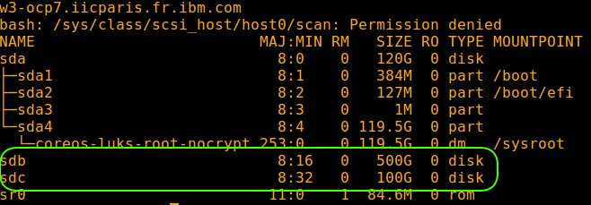

# Prepare Redhat Openshift for Cloud Paks

## Hardware requirements

-  One computer which will be called **Installer** that runs Linux or MacOS.

## System requirements

<!--

- One [OCP 3.11](https://github.com/bpshparis/sandbox/blob/master/Installing-Redhat-Openshift-3.11-on-Bare-Metal.md#installing-redhat-openshift-311-on-bare-metal) or [OCP 4](https://github.com/bpshparis/sandbox/blob/master/Installing-Redhat-Openshift-4-on-Bare-Metal.md#installing-redhat-openshift-4-on-bare-metal)
- One [centos/redhat Cli](https://github.com/bpshparis/sandbox/blob/master/Installing-Redhat-Openshift-4.3-on-Bare-Metal.md#create-cli) with **oc** and **kubectl** commands installed
- One **WEB server** where following files are available in **read mode**:
  - [nfs-client.zip](scripts/nfs-client.zip)
  -->

- One  [OCP 4](https://github.com/bpshparis/sandbox/blob/master/Installing-Redhat-Openshift-4-on-Bare-Metal.md#installing-redhat-openshift-4-on-bare-metal)

- One **WEB server** where following files are available in **read mode**:
  - [Linux](https://mirror.openshift.com/pub/openshift-v4/clients/ocp/latest/openshift-client-linux.tar.gz) or [MacOS](https://mirror.openshift.com/pub/openshift-v4/clients/ocp/latest/openshift-client-mac.tar.gz) Openshift command line interface
  - Portworx Enterprise Edition (Part number **G00BXZX**) downloaded either from [IBM Passport Advantage](https://www.ibm.com/software/passportadvantage/pao_customer.html) or from [XL](https://w3-03.ibm.com/software/xl/download/ticket.wss).


:checkered_flag::checkered_flag::checkered_flag:

<br>

<!--
## Install managed-nfs-storage Storage Class

### Install NFS server

> :information_source: Run this on Cli or any **centos/redhat linux device**

```
NFS_PATH="/exports"
```

```
cat > installNFSServer.sh << EOF
mkdir /exports
echo "$NFS_PATH *(rw,sync,no_root_squash)" >> /etc/exports
[ ! -z $(rpm -qa nfs-utils) ] && echo nfs-utils installed || { echo nfs-utils not installed; yum install -y nfs-utils rpcbind; }
systemctl restart nfs
showmount -e
systemctl enable nfs
systemctl stop firewalld
systemctl disable firewalld
setenforce 0
sed -i -e 's/^SELINUX=\w*/SELINUX=disabled/' /etc/selinux/config
EOF
```

```
chmod +x installNFSServer.sh && ./installNFSServer.sh
```

### Test NFS server

#### Mount resource and test NFS server availability

> :information_source: Run this on Cli or any **centos/redhat linux device**

```
NFS_SERVER="cli-ocp5"
NFS_PATH="/exports"
```

```
[ ! -z $(rpm -qa nfs-utils) ] && echo nfs-utils installed || { echo nfs-utils not installed; yum install -y nfs-utils rpcbind; }

[ ! -d "/mnt/$NFS_SERVER" ] && mkdir /mnt/$NFS_SERVER && mount -t nfs $NFS_SERVER:$NFS_PATH /mnt/$NFS_SERVER

touch /mnt/$NFS_SERVER/SUCCESS && echo "RC="$?
```

> :warning: Next commands shoud display **SUCCESS**

> :information_source: Run this on Cli or any **centos/redhat linux device**

```
[ -z $(command -v sshpass) ] && { yum install -y sshpass; export SSHPASS="spcspc"; }

sshpass -e ssh -o StrictHostKeyChecking=no $NFS_SERVER ls $NFS_PATH/ 
```

#### Clean things

> :information_source: Run this on Cli or any **centos/redhat linux device**

```
NFS_SERVER="cli-ocp5"
NFS_PATH="/exports"
```

```
rm -f /mnt/$NFS_SERVER/SUCCESS && echo "RC="$?

sshpass -e ssh -o StrictHostKeyChecking=no $NFS_SERVER ls $NFS_PATH/

umount /mnt/$NFS_SERVER && rmdir /mnt/$NFS_SERVER && echo "RC="$?
```


### Install managed-nfs-storage Storage Class 

#### Log in OCP

> :information_source: Run this on **OCP 3.11** Cli

```
oc login https://cli-$OCP:8443 -u admin -p admin --insecure-skip-tls-verify=true
```

> :information_source: Run this on **OCP 4.3** Cli

```
oc login https://cli-$OCP:6443 -u admin -p admin --insecure-skip-tls-verify=true
```


#### Install and test storage class

> :information_source: Run this on Cli

```
WEB_SERVER_SOFT_URL="http://web/soft"
NFS_SERVER="cli-ocp5"
NFS_PATH="/exports"
```

```
cd ~ 
wget -c $WEB_SERVER_SOFT_URL/nfs-client.zip
[ -z $(command -v unzip) ] && { yum install unzip -y; } || echo "unzip already installed"
unzip nfs-client.zip
cd nfs-client/

oc new-project storage

sed -i -e 's/namespace:.*/namespace: '$(oc project -q)'/g' ./deploy/rbac.yaml
oc create -f deploy/rbac.yaml
oc adm policy add-scc-to-user hostmount-anyuid system:serviceaccount:$(oc project -q):nfs-client-provisioner

sed -i -e 's/<NFS_SERVER>/'$NFS_SERVER'/g' deploy/deployment.yaml
sed -i -e 's:<NFS_PATH>:'$NFS_PATH':g' deploy/deployment.yaml

oc create -f deploy/class.yaml
oc create -f deploy/deployment.yaml

sleep 10

oc get pods
oc logs $(oc get pods | awk 'NR>1 {print $1}')
oc create -f deploy/test-claim.yaml
oc create -f deploy/test-pod.yaml
```

> :warning: Wait for test-pod to be deployed and check that next commands display **SUCCESS**

> :information_source: Run this on Cli

```
sleep 5 && VOLUME=$(oc get pvc | awk '$1 ~ "test-claim" {print $3}') && echo $VOLUME

sshpass -e ssh -o StrictHostKeyChecking=no $NFS_SERVER ls /$NFS_PATH/$(oc project -q)-test-claim-$VOLUME && cd ~
```

:checkered_flag::checkered_flag::checkered_flag:
-->


## Exposing Openshift Registry

> :bulb: Target is to be able to push images Openshift registry in a secure way.

> :information_source: Commands below are valid for a **Linux/Centos 7**.

> :warning: Some of commands below will need to be adapted to fit Linux/Debian or MacOS .

### Install oc and kubectl commands

> :warning: Adapt settings to fit to your environment.

> :information_source: Run this on Installer

```
WEB_SERVER_OC_URL="http://web/soft/openshift-client-linux-4.3.1.tar.gz"
OC_FILE="openshift-client-linux-4.3.1.tar.gz"
```

```
[ -z $(command -v oc) ] && { wget -c $WEB_SERVER_OC_URL; tar xvzf $OC_FILE -C $(echo $PATH | awk -F':' '{print $1}'); } || echo oc installed
```

```
yum -y install bash-completion
oc completion bash >>/etc/bash_completion.d/oc_completion
```

> :bulb: Logout and login bash for change to take effect.

### Install podman

> :information_source: Run this on Installer

```
[ -z $(command -v podman) ] && { yum install podman runc buildah skopeo -y; } || echo "podman already installed"
```

### Log in cluster default project

<!--
> :information_source: Run this on **OCP 3.11** Cli

```
oc login https://cli-$OCP:8443 -u admin -p admin --insecure-skip-tls-verify=true -n default
```
> :arrow_heading_down: [Exposing Openshift 3 Registry](#exposing-openshift-3-registry)

<br>

> :information_source: Run this on **OCP 4.3** Cli
-->

> :warning: Adapt settings to fit to your environment.

> :information_source: Run this on Installer

```
LB_HOSTNAME="cli-ocp9"
NS="default"
```

```
oc login https://$LB_HOSTNAME:6443 -u admin -p admin --insecure-skip-tls-verify=true -n $NS
```

<!--
> :arrow_heading_down: [Exposing Openshift 4 Registry](#exposing-openshift-4-registry)

<br>

### Exposing Openshift 3 Registry

> :information_source: Run this on **OCP 3.11** Cli

```
[ -z $(command -v jq) ] && { wget -c https://github.com/stedolan/jq/releases/download/jq-1.6/jq-linux64 && chmod +x jq-linux64 && mv jq-linux64 /usr/local/sbin/jq; } || echo jq already installed
```

#### Check Openshift 3 registry route

> :warning: Termination should display **passthrough** if not proceed as describe [here](https://docs.openshift.com/container-platform/3.11/install_config/registry/securing_and_exposing_registry.html#exposing-the-registry)

> :information_source: Run this on **OCP 3.11** Cli

```
oc get route/docker-registry -n default -o json | jq -r .spec.tls.termination
```

#### Trust Openshift 3 registry

> :information_source: Run this on **OCP 3.11** Cli

```
REG_HOST=$(oc get route/docker-registry -n default -o json | jq -r .spec.host) && echo $REG_HOST

mkdir -p /etc/docker/certs.d/$REG_HOST

sshpass -e scp -o StrictHostKeyChecking=no m1-$OCP:/etc/origin/master/ca.crt /etc/docker/certs.d/$REG_HOST
```

> :arrow_heading_down: [Log in Openshift registry](#log-in-openshift-registry)

<br>
-->

### Exposing Openshift Registry

> :information_source: Run this on Installer

```
oc patch configs.imageregistry.operator.openshift.io/cluster --type merge -p '{"spec":{"defaultRoute":true}}'
```

>:bulb: You will be logged out from api server for few seconds.

>:bulb: Wait until **oc registry info** command display something like **default-route-openshift-image-registry...** instead of the internal registry e.g. **image-registry.openshift-image-registry.svc:5000**.


```
watch -n5 oc registry info
```

#### Trust Openshift registry

> :information_source: Run this on Installer

```
REG_HOST=$(oc registry info) && echo $REG_HOST

mkdir -p /etc/containers/certs.d/$REG_HOST

yes y | oc extract secret/router-ca --keys=tls.crt -n openshift-ingress-operator --confirm

yes y | cp -v tls.crt /etc/containers/certs.d/$REG_HOST/
```

<br>

#### Log in Openshift registry

> :information_source: Run this on Installer

```
podman login -u $(oc whoami) -p $(oc whoami -t) $REG_HOST
```

#### Tag an image with Openshift registry hostname and push it

<!--
if error:
Trying to pull docker.io/library/busybox...
  toomanyrequests: You have reached your pull rate limit. You may increase the limit by authenticating and upgrading: https://www.docker.com/increase-rate-limit
Error: error pulling image "busybox": unable to pull busybox: 3 errors occurred:
	* Error initializing source docker://registry.access.redhat.com/busybox:latest: Error reading manifest latest in registry.access.redhat.com/busybox: name unknown: Repo not found
	* Error initializing source docker://registry.redhat.io/busybox:latest: unable to retrieve auth token: invalid username/password: unauthorized: Please login to the Red Hat Registry using your Customer Portal credentials. Further instructions can be found here: https://access.redhat.com/RegistryAuthentication
	* Error initializing source docker://busybox:latest: Error reading manifest latest in docker.io/library/busybox: toomanyrequests: You have reached your pull rate limit. You may increase the limit by authenticating and upgrading: https://www.docker.com/increase-rate-limit

Then create an account at https://hub.docker.com/

and login into docker.io
podman login -u userid -p password docker.io

-->

> :information_source: Run this on Installer

```
podman pull busybox
podman tag docker.io/busybox $REG_HOST/$(oc project -q)/busybox
```

> :warning: Now you have to be able to push images to Openshift registry

> :information_source: Run this on Installer

```
podman push $REG_HOST/$(oc project -q)/busybox

oc get is | grep busybox
```

<br>

:checkered_flag::checkered_flag::checkered_flag:

<br>


<!-- 

podman pull busybox

podman login default-route-openshift-image-registry.apps.$OCP.iicparis.fr.ibm.com -u $(oc whoami) -p $(oc whoami -t) --tls-verify=false

podman push default-route-openshift-image-registry.apps.$OCP.iicparis.fr.ibm.com/validate/busybox --tls-verify=false

-->

## Installing Portworx

### Check worker devices availability

> :warning: Adapt settings to fit to your environment.

> :information_source: Run this on Installer

```
OCP="ocp9"
WORKERS_NODES="w1-$OCP w2-$OCP w3-$OCP w4-$OCP w5-$OCP"
```

```
for node in $WORKERS_NODES; do   ssh -o StrictHostKeyChecking=no -l core $node "hostname; echo '- - -' > /sys/class/scsi_host/host0/scan; lsblk"; done
```

>:bulb: All workers should have **2 raw unformatted disks** each.



> :warning: Metadata volume (e.g. sdc) should be **>= 64GB**

> :bulb: Application volume (e.g. sdb) will install succesfully if **>= 250 GB**

### Install Portworx

> :bulb: To avoid network failure, launch installation on **locale console** or in a **screen**

> :information_source: Run this on Installer

```
[ ! -z $(command -v screen) ] && echo screen already installed || yum install screen -y

pkill screen; screen -mdS ADM && screen -r ADM
```

#### Set environment

> :warning: Adapt settings to fit to your environment.

> :information_source: Run this on Installer

```
OCP="ocp9"
LB_HOSTNAME="cli-$OCP"
NS="kube-system"
WEB_SERVER_PX_URL="http://web/cloud-pak/cpdv3.5.0_portworx.tgz"
PX_FILE="cpdv3.5.0_portworx.tgz"
APP_DEV="/dev/sdb"
MD_DEV="/dev/sdc"
```

#### Extract files

> :information_source: Run this on Installer

```
cd ~
wget -c $WEB_SERVER_PX_URL
tar xvzf $PX_FILE
```

#### Load PX images in Openshift registry

> :information_source: Run this on Installer

```
oc login https://cli-$OCP:6443 -u admin -p admin --insecure-skip-tls-verify=true -n $NS

REG_HOST=$(oc registry info) && echo $REG_HOST
podman login -u $(oc whoami) -p $(oc whoami -t) $REG_HOST

~/cpd-portworx/px-images/process-px-images.sh -r $REG_HOST -u $(oc whoami) -p $(oc whoami -t) -s $(oc project -q) -c podman -t ~/cpd-portworx/px-images/px_2.6.2.0-dist.tgz
```

> :bulb: Check PX images are loadd in Openshift registry

```
oc get is | grep $NS
```

#### Install PX operator

> :information_source: Run this on Installer

```
~/cpd-portworx/px-install-4.x/px-install.sh install-operator
```

> :warning: Wait for operator pod to be running

```
watch "oc get po -n $NS | grep portworx-operator"
```

> :bulb: Leave watch with **Ctrl + c** when pod is **1/1 Running**

#### Install PX cluster

> :information_source: Run this on Installer

```
~/cpd-portworx/px-install-4.x/px-install.sh install-storage $APP_DEV $MD_DEV
```

> :bulb: Monitor cluster installation and wait for all pods to be **1/1 Running**

```
watch -n5 "oc get po -n $NS | egrep -w 'portworx|px'"
```

#### Check PX cluster installation

> :information_source: Run this on Installer

```
PX_POD=$(kubectl get pods -l name=portworx -n $NS -o jsonpath='{.items[0].metadata.name}')

oc exec $PX_POD -n $NS -- /opt/pwx/bin/pxctl status | grep '^Status'
```

> :bulb: PX status should be **operational** 

<!--

#### Test PX PVC

> :information_source: Run this on Installer

```
~/cpd-portworx/px-install-4.x/px-install.sh install-sample-pvc

oc create -f ~/cpd-portworx/px-install-4.x/px-test.yaml
```

> :bulb: Check pvc is **Bound** and pod is **1/1 Running** 

```
watch -n5 "oc get pvc | grep test && oc get po | grep test"
```

-->

#### Add storage classes for Cloud Pak

> :information_source: Run this on Installer

```
~/cpd-portworx/px-install-4.x/px-sc.sh
```

> :bulb: Check you have at least **30 storage classes available**

```
oc get sc
```

#### Set default  storageclass

> :information_source: Run this on Installer

```
SC="portworx-shared-gp3"

oc patch storageclass $SC -p '{"metadata": {"annotations":{"storageclass.kubernetes.io/is-default-class":"true"}}}'
```

<!--

### Add persistent storage to the registry

##### Remove emptyDir storage

> :information_source: Run this on Installer

```
oc patch configs.imageregistry.operator.openshift.io --type='json' -p='[{"op": "remove", "path": "/spec/storage/emptyDir"}]' --dry-run

oc patch configs.imageregistry.operator.openshift.io --type='json' -p='[{"op": "remove", "path": "/spec/storage/emptyDir"}]'
```

##### Add persistent storage to the registry

> :information_source: Run this on Installer

```
oc patch configs.imageregistry.operator.openshift.io cluster --type merge --patch '{"spec":{"storage":{"pvc":{"claim": ""}}}}'
```
-->

<br>

:checkered_flag::checkered_flag::checkered_flag:
