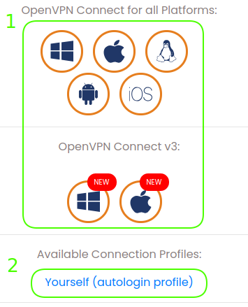

Mise à disposition de la sandbox IBM Cloud Pak for Data

Bonjour,

voici les identifiants:

User				Paswword

utiles une seule fois pour récupérer utiles une seule fois pour récupérer (voir pièce jointe pour info détaillée) le client VPN et le fichier de configuration ici:

https://bscvpn.nca.ihost.com

Une fois la connexion établie, ajouter ou modifier les lignes suivantes dans votre fichier hosts

e.g. /etc/hosts ou C:\Windows\ System32\drivers\etc\hosts

172.16.187.40 console-openshift-console.apps.ocp4.iicparis.fr.ibm.com

172.16.187.40 oauth-openshift.apps.ocp4.iicparis.fr.ibm.com

172.16.187.40 cpd-cpd-cpd.apps.ocp4.iicparis.fr.ibm.com

172.16.187.40 ds-proxy-cpd.apps.ocp4.iicparis.fr.ibm.com

172.16.187.40 mongodb-1620826102394152-ops-manager-svc-cpd.apps.ocp4.iicparis.fr.ibm.com

172.16.187.170 console-openshift-console.apps.ocp17.iicparis.fr.ibm.com

172.16.187.170 oauth-openshift.apps.ocp17.iicparis.fr.ibm.com

172.16.187.170 cpd-cpd-cpd.apps.ocp17.iicparis.fr.ibm.com

Accès à la Console Cloud Pak for Data en tant que user **admin** mot de passe **password**:
https://cpd-cpd-cpd.apps.ocp4.iicparis.fr.ibm.com

https://cpd-cpd-cpd.apps.ocp17.iicparis.fr.ibm.com

Accès à Cognos:

https://cpd-cpd-cpd.apps.ocp4.iicparis.fr.ibm.com/cognosanalytics/bi/?perspective=home

Accès à mongoDB en tant user **admin** mot de passe **l*2MUyf69W-?5K?k**:

http://mongodb-1620826102394152-ops-manager-svc-cpd.apps.ocp4.iicparis.fr.ibm.com/account/login

Accès à Db2:

https://cpd-cpd-cpd.apps.ocp4.iicparis.fr.ibm.com/dmc/console/#open/dmc-1620821974066340?serviceInstanceNamespace=cpd&serviceInstanceDisplayName=Data-Management-Console

admin:pwd Db2 -> db2inst1:iG6K3Gg@*#g_S1z4

admin:pwd Db2wh -> db2inst1:as7_@*3xZF*iV9S4

Accès à la Console Cloud Pak for Data en tant que user **admin** mot de passe **password**:

https://cpd-cpd-cpd.apps.ocp17.iicparis.fr.ibm.com/data/catalogs/

Accès à la Console Openshift en tant que user **admin** mot de passe **admin**:
https://console-openshift-console.apps.ocp4.iicparis.fr.ibm.com

Accès aux clusters via la commande oc:
oc login https://172.16.187.40:6443 -u admin -p admin --insecure-skip-tls-verify=true -n cpd

oc login https://172.16.187.170:6443 -u admin -p admin --insecure-skip-tls-verify=true -n cpd

Installer les commandes oc and kubectl si necessaire:
Linux:
https://mirror.openshift.com/pub/openshift-v4/clients/ocp/latest/openshift-client-linux.tar.gz
Windows:
https://mirror.openshift.com/pub/openshift-v4/clients/ocp/latest/openshift-client-windows.zip
MacOS:
https://mirror.openshift.com/pub/openshift-v4/clients/ocp/latest/openshift-client-mac.tar.gz

Enjoy !