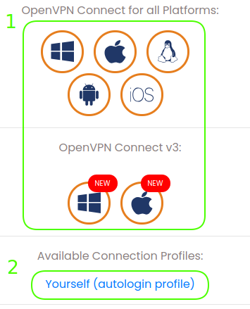

Mise à disposition de votre sandbox IBM Cloud Pak for Data

Bonjour,

voici vos identifiants utiles une seule fois pour récupérer le client VPN et le fichier de configuration ici:

https://bscvpn.nca.ihost.com

User:				Paswword:

Une fois la connexion établie, ajouter les lignes suivantes à votre fichier hosts

e.g. /etc/hosts ou C:\Windows\ System32\drivers\etc\hosts

172.16.187.70 console-openshift-console.apps.ocp7.iicparis.fr.ibm.com

172.16.187.70 oauth-openshift.apps.ocp7.iicparis.fr.ibm.com

172.16.187.70 cpd-cpd-cpd.apps.ocp7.iicparis.fr.ibm.com

172.16.187.70 cli-ocp7.iicparis.fr.ibm.com cli-ocp7

Accès à la console ESX:

(Firefox) https://172.16.161.138/ui en tant que user **root** mot de passe **spcspc**

Manage snapshot sur l'ESX:

en mode ssh sur 172.16.161.138 en tant que user **root** mot de passe **spcspc**

https://github.com/bpshparis/sandbox/blob/master/Manage-ESX-snapshots.md#manage-esx-snapshots

Accès à la Console Openshift en tant que user **admin** mot de passe **admin**:
https://console-openshift-console.apps.ocp7.iicparis.fr.ibm.com

Accès à la Console Cloud Pak for Data en tant que user **admin** mot de passe **password**:
https://cpd-cpd-cpd.apps.ocp7.iicparis.fr.ibm.com

Accès au cluster via la commande oc:
oc login https://172.16.187.70:6443 -u admin -p admin --insecure-skip-tls-verify=true
Install oc and kubectl if needed:
Linux:
https://mirror.openshift.com/pub/openshift-v4/clients/ocp/latest/openshift-client-linux.tar.gz
Windows:
https://mirror.openshift.com/pub/openshift-v4/clients/ocp/latest/openshift-client-windows.zip
MacOS:
https://mirror.openshift.com/pub/openshift-v4/clients/ocp/latest/openshift-client-mac.tar.gz

Accès ssh au nodes du cluster depuis cli-ocp7 (172.16.187.70) en tant que user **core** puis sudo passwd si besoin d'être root:

m1-ocp7
ssh://core@172.16.187.71

m2-ocp7
ssh://core@172.16.187.72

m3-ocp7
ssh://core@172.16.187.73

w1-ocp7
ssh://core@172.16.187.74

w2-ocp7
ssh://core@172.16.187.75

w3-ocp7
ssh://core@172.16.187.76

Enjoy !